# SOCIAL & PLAY V1 — Báo cáo đêm (2026-09-26 → 2026-09-27)

**Trạng thái cuối: `SOCIAL_PLAY_V1_PARTIALLY_READY`**. Lý do nằm ở §13 và cuối báo cáo.

Khung giờ: 2026-09-26 16:15Z → 18:30Z (23:15 → 01:30 giờ Việt Nam). Owner ngủ, agent tự chạy.

Không làm các việc sau (theo lệnh): merge #229/#231, migration production, deploy backend, bật cờ `FAS_*` production, xoá dữ liệu production, xoay bí mật, sửa branch protection, crawler, RR143557, TTS production, Icons8, AWS Worker EC2, chạy full backend suite trên Windows, `docker system prune`.

"Đã chạy trên production" trong báo cáo này chỉ dùng cho phần thật sự chạy trên `fanfic.world`. Mọi thứ khác ghi rõ là mock cục bộ, bản production cục bộ (`next start`) hoặc Appwrite thử.

## Bảng tổng hợp

| Area | Before | After | Live/Test | Tests | Remaining risk | Release status |
|---|---|---|---|---|---|---|
| Gói B: Studio, Giải trí, ẩn Âm nhạc | Chưa deploy (web đang ở bản #228) | Live từ `eea7dad` (Cloudflare `85a15fdf…`) | **Chạy thật trên production**, Chrome hiện, 1440 + 390 | Studio khách 19/19, Giải trí 13/13, hồi quy 10/10; tải MP3 khi đăng nhập 200 | Chưa bấm **Phát** thẻ Studio khi đã đăng nhập trong cửa sổ hiện | `PACKAGE_B_BLOCKED_…` (§2) |
| Phát R2 lỗi 503 | Một lần 503 trên URL ký mới | Nguyên nhân: R2 lỗi thoáng qua trên **một** request; không phải lỗi ký, hết hạn hay Range | **Production** | Resolve lại 3/3 → 200; chương công khai 206, phát thật | Engine chỉ thử lại 2 lần; nếu R2 lỗi kéo dài thì hiện thông báo lỗi | Không cần sửa (§3) |
| Studio: danh sách giọng (#232) | API lỗi → ô chọn giọng trống, nút Tạo bị khoá, không báo gì; 2 lần gọi `/api/voices` | Có thông báo lỗi + nút **thử lại**; chỉ 1 lần gọi | Bản production cục bộ + API mock | 4 test mới; web 1086/0; Chrome 8/8 | — | Chờ owner merge + deploy web |
| Cộng đồng + Hồ sơ (#229) | 4 lỗi giao diện (§12) | Đã sửa | Mock cục bộ, 1600/1440/1366/390 | 4 test mới; web 1092/0; 12/12 trạng thái | Cần migration + cờ mới dùng được ở production | Chờ merge (cờ OFF) → migration |
| Backend A trên Appwrite | Hồ sơ đọc thiếu trường; phiên hợp lệ bị 401 khi gọi đồng thời | Đã sửa | Appwrite 1.9.6 + MongoDB thử | Gói A 47/47; 108 request đồng thời → 0 lần 401 | — | Như trên |
| XP nguyên tử (#231) | 7/24 và 29/48 lần ghi trả 503 khi tranh chấp; mở gói mất gói khi crash | 24/24, 48/48; cấp bù đúng vật phẩm | Appwrite thử | HTTP 13/13 + 4/4; tầng dịch vụ 11/11 | Trần thưởng chỉ **mềm** khi chạy nhiều instance | Bật `FAS_XP_ATOMIC` sau `FAS_SOCIAL_V1_SCHEMA` |
| Giao diện Memory + Caro (#231) | Hàng Caro có quân cao gấp đôi hàng trống | Bàn vuông, 15 hàng đều | Mock cục bộ, Chrome hiện | Luyện tập 10/10 ×2, Memory 9/9 ×2, phòng trên di động 6/6, đấu đôi 26/26; web 1091/0 | — | `FAS_GAMES_V1` OFF |
| Trang chủ tải trùng (#233) | Đã đăng nhập: 17 request, 5 endpoint gọi 2 lần | 12 request, 0 trùng | Bản production cục bộ | 3 test mới; web 1088/0 | — | Chờ merge + deploy web |
| Ảnh nền trên điện thoại (#233) | 390px: tải cả tấm 1672px lẫn tấm 960px (587–606 KB) | Chỉ tấm 960px (148–151 KB) | Đo trên production vs bản sửa | 3 test mới | — | Chờ merge + deploy web |
| Hiệu năng game và cộng đồng | — | CLS ≤ 0,0005; 0 tràn ngang; 0 lỗi console; 0 request trùng | Bản production cục bộ + production (khách) | §12 | Desktop tải video nền 5–10 MB mỗi trang (tính năng thiết kế) | Ghi nhận, chờ owner quyết |
| Migration production A + XP | Chưa chạy | **Chưa chạy, đã DỪNG** | — | Diễn tập trên Appwrite thử: 37 s, 0 thiếu | Không truy cập được host (§13) | **BLOCKED** |
| Multiplayer | — | — | Chỉ Appwrite thử | Gói C 20/22 (2 lỗi harness, đọc lại 10/10) | Trần thưởng mềm khi nhiều instance | `MULTIPLAYER_PRODUCTION_BLOCKED` |

## 1. Production: SHA và phiên bản đang chạy

Đo lại lúc 2026-09-26 ~18:00Z, chỉ đọc.

| Hạng mục | Giá trị |
|---|---|
| `origin/main` | `eea7dad` (#230 gói B, squash) |
| Web (Cloudflare worker `fanfic-web`) | Current Version `85a15fdf-55e0-4656-b886-85d3c3522726`: owner deploy từ `eea7dad`, build `fl6Bxsp9zsiQHcHLaxpwE`, chunk live khớp build 14/14 |
| Bản web để rollback | `4899c513-3513-4bdb-a839-9846eb26899f` (bản #228) |
| API (Render `fas-prod-api`) | `/api/health`: `commit_sha e293a01e0862…`, `production`, `appwrite` + `r2`, `inline_worker False`. Lần gọi đầu mất **42,8 s** (Render khởi động nguội); các lần sau 0,26–0,84 s |
| Cờ mới trên production | Chưa có trong mã đang chạy: `/api/limits` → `capabilities: None`; `/api/games/config` → 404 |
| Appwrite | 1.9.6 + MongoDB 8.2.5, `https://appwrite-dev.fanfic.world/v1` (Cloudflare proxy) → AWS `54.179.200.223` (`i-064abacf35ebe2c8a`); project `fanfic-world-prod`, database `fanfic_world_prod` |
| Bundle live | Gọi API `https://fas-prod-api.onrender.com`; 0 chỗ trỏ `localhost` |

## 2. Kết luận smoke gói B

**`PACKAGE_B_BLOCKED_LOGGED_IN_STUDIO_PLAY_NOT_RUN_OWNER_SESSION_LOCKED`**

Toàn bộ phần dưới đây đã **chạy thật trên production**:

- **Studio, chế độ khách** (1440 + 390 bằng giả lập CDP), 19/19:
  - hiện 57 giọng; bản nháp gõ thật được giữ lại;
  - bấm Tạo → chuyển sang `/login?next=…`, 0 lần `POST /api/jobs`;
  - quay lại thì khôi phục bản nháp và hiện thông báo;
  - không tràn ngang, 0 lỗi console, CTA cao 44px.
- **Studio khi đã đăng nhập**, qua Chrome của owner (cửa sổ bị ẩn):
  - 24 thẻ audio thật;
  - Tải MP3: `/api/audio/{id}/url?download=true` trả 200, URL R2 có `content-disposition: attachment`, 25.395 byte (không lưu tệp).
- **Giải trí**, 13/13:
  - 0 request nhạc, 0 audio tự phát;
  - hiện "Âm nhạc — sẽ quay lại sau.";
  - 0 iframe cho tới khi bấm "Chơi ngay", bấm xong đúng 1 iframe.
- **Hồi quy**, 10/10:
  - các trang `/`, `/library`, truyện `nov_rr_136586`, chương `ch_136586_0001`;
  - ba chế độ Đọc / Đọc + Nghe / Nghe;
  - Back/Forward; 390px không tràn.

**Phần chưa chạy:** bấm **Phát** trên một thẻ Studio khi đã đăng nhập, trong một cửa sổ hiện. Không làm được vì:

- Phiên Windows của owner đang khoá. Mọi cửa sổ Chrome của owner báo `visibilityState: hidden`, `outerWidth 0` (kiểm lại lúc 18:0xZ), và Chrome hoãn tải media khi cửa sổ ẩn.
- Không được đăng nhập tài khoản owner vào Chrome QA.

Đường phát này dùng chung `AudioEngine` + `resolveAudio` + R2 với chương công khai, và chương công khai đã phát thật (§3). Không thấy lỗi nào. Kết luận vẫn là BLOCKED vì bước này chưa thật sự chạy.

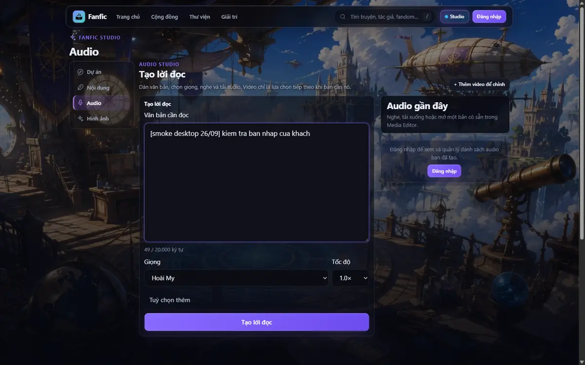 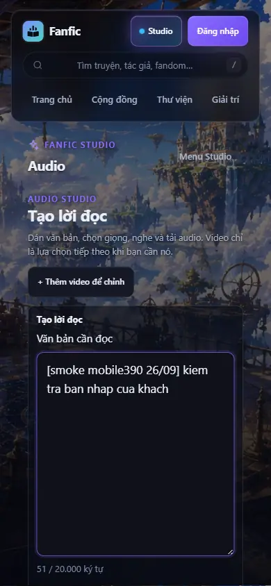
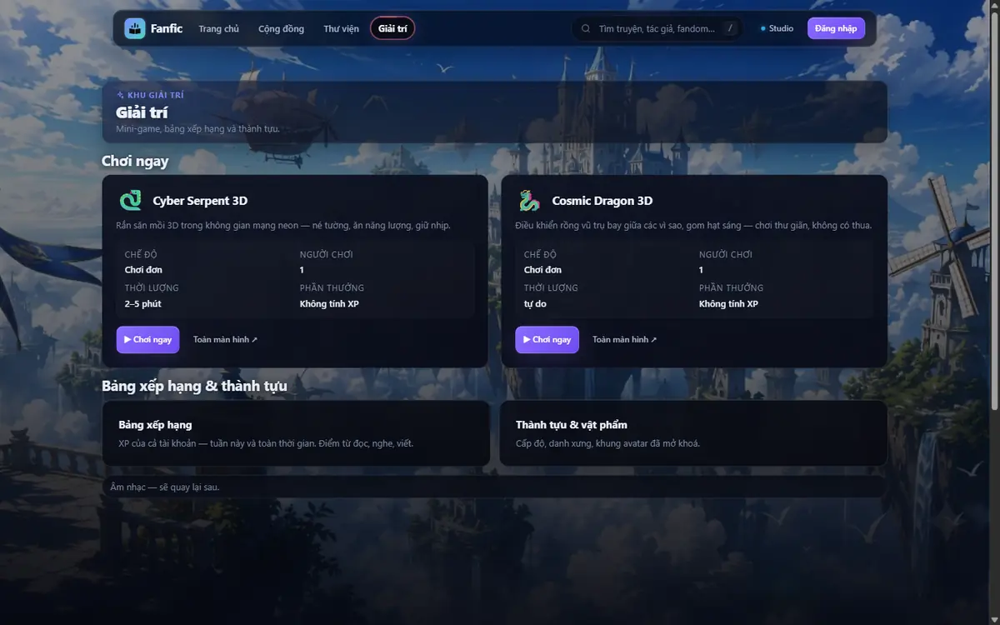 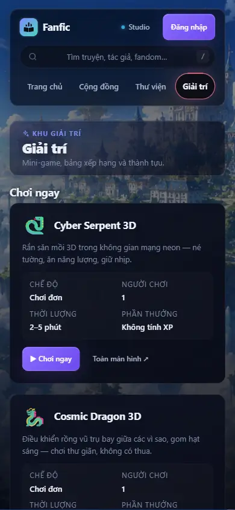 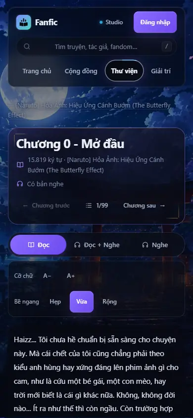

## 3. Phát R2 lỗi 503: nguyên nhân và bằng chứng

- Request lỗi đi tới **R2** (`a0084…r2.cloudflarestorage.com`, header `server: cloudflare`), không phải Render.
  - URL còn mới: `X-Amz-Date 20260926T160658Z`, hạn 14400 s.
  - Đối tượng: `audio/…/chp_0725aa76a4e04e9c/….mp3`.
  - Bước resolve `/api/audio/{id}/url` vẫn trả 200.
- Lấy URL mới 3 lần cho **cùng** đối tượng: 3/3 resolve 200 (146–241 ms), `GET` R2 trả 200.
- Chương công khai, trong cửa sổ hiện: resolve 200 → `GET` R2 `Range: bytes=0-` → **206** `audio/mpeg`, `Content-Range bytes 0-6467538/6467539`, phát thật (t > 0,5 s, dài 808 s).
- Engine đã có cơ chế thử lại có giới hạn: khi lỗi, `lamMoiUrl()` lấy URL ký mới, tối đa 2 lần (`TOI_DA_LAM_MOI = 2`).
- **Kết luận:** lỗi thoáng qua phía R2 trên **một** request. Không phải lỗi ký, hết hạn hay Range. Không cần sửa mã, không tạo audio mới.
- Ghi chú: mỗi lần Phát có 2 lần gọi `/url`. Đó là thiết kế, không phải trùng: một lần lấy URL phát, một lần `?download=true` lấy liên kết tải. Log QA cố ý cắt query (không lưu URL đã ký), nên trong log hai request trông giống nhau.

## 4. Ảnh Cộng đồng: TRƯỚC / SAU

Trên PR #229 (`5f88f1a`), mock cục bộ, tài khoản thử `qa_*` (không dùng tài khoản thật).

| TRƯỚC: chân trang 390px mất khoảng đệm | SAU: Cộng đồng 390px | SAU: Cộng đồng 1440px |
|---|---|---|
| 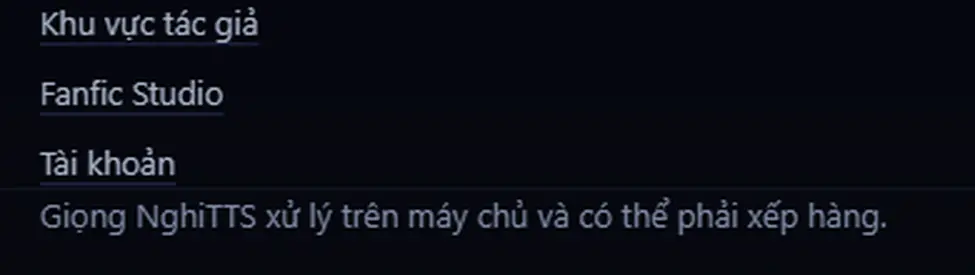 | 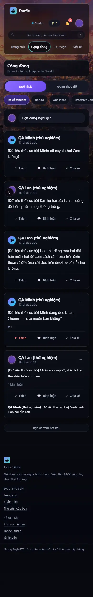 | 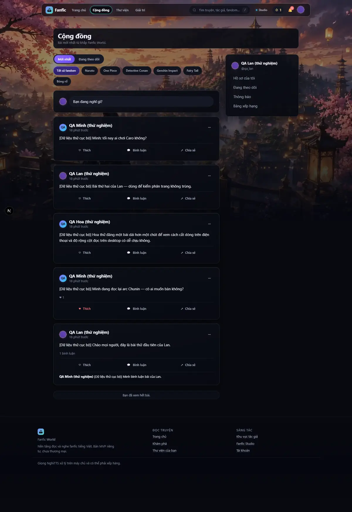 |

- Trạng thái lỗi API kèm Thử lại: 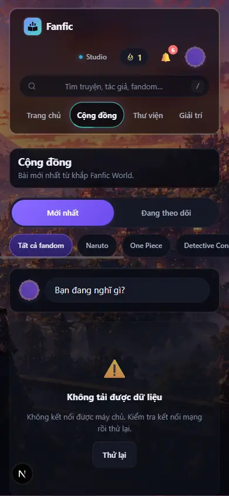
- Kết quả đo ở 4 viewport:
  - 0 tràn ngang, CLS lúc tải ≤ 0,07;
  - focus bàn phím nhìn thấy được 14/14;
  - trạng thái 12/12: xem thêm bình luận (2 → 5), rỗng, lỗi + thử lại, skeleton khi chậm 3 s;
  - góc nhìn khách / chủ / người xem đều đúng.

## 5. Ảnh Hồ sơ: TRƯỚC / SAU

| TRƯỚC: xem trước trong trình sửa hồ sơ bị xẹp còn 1px | SAU |
|---|---|
| 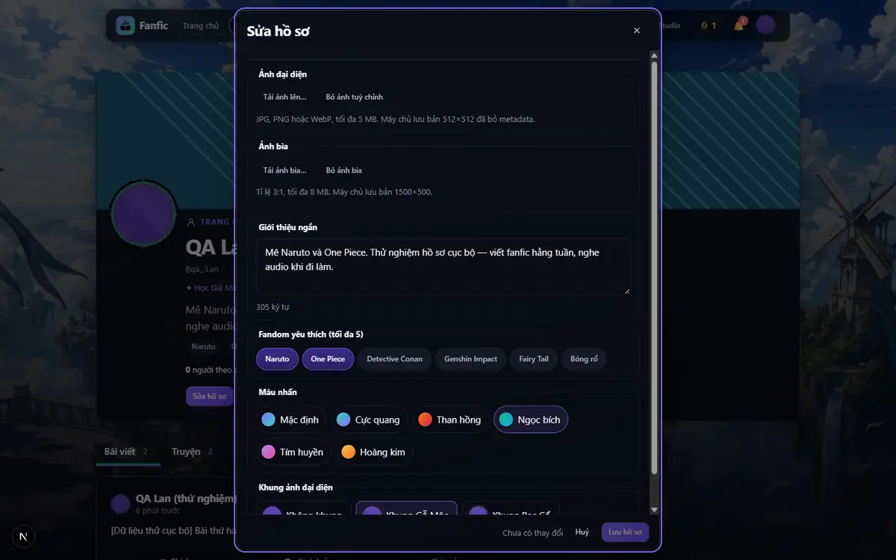 | 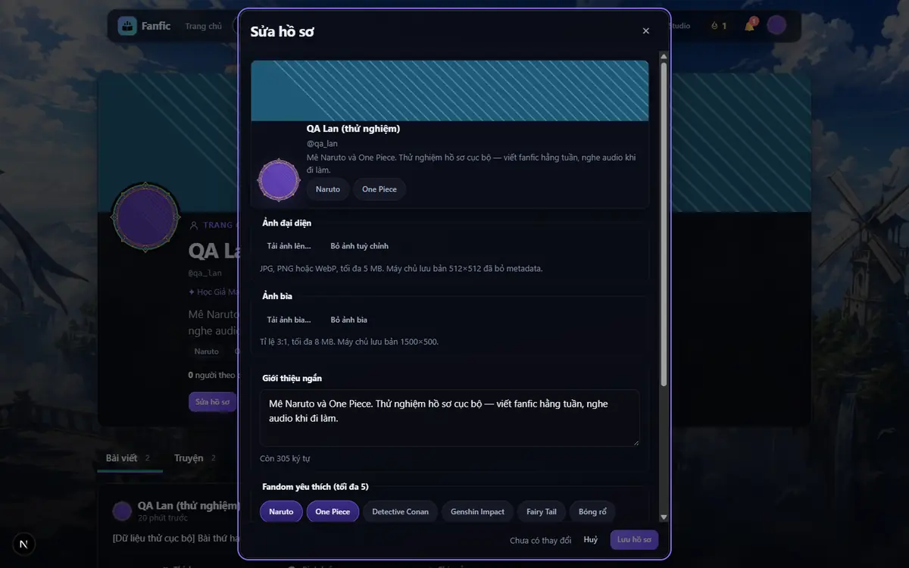 |

| TRƯỚC: khung Gỗ Mộc vô hình trên nền tối | SAU |
|---|---|
|  | 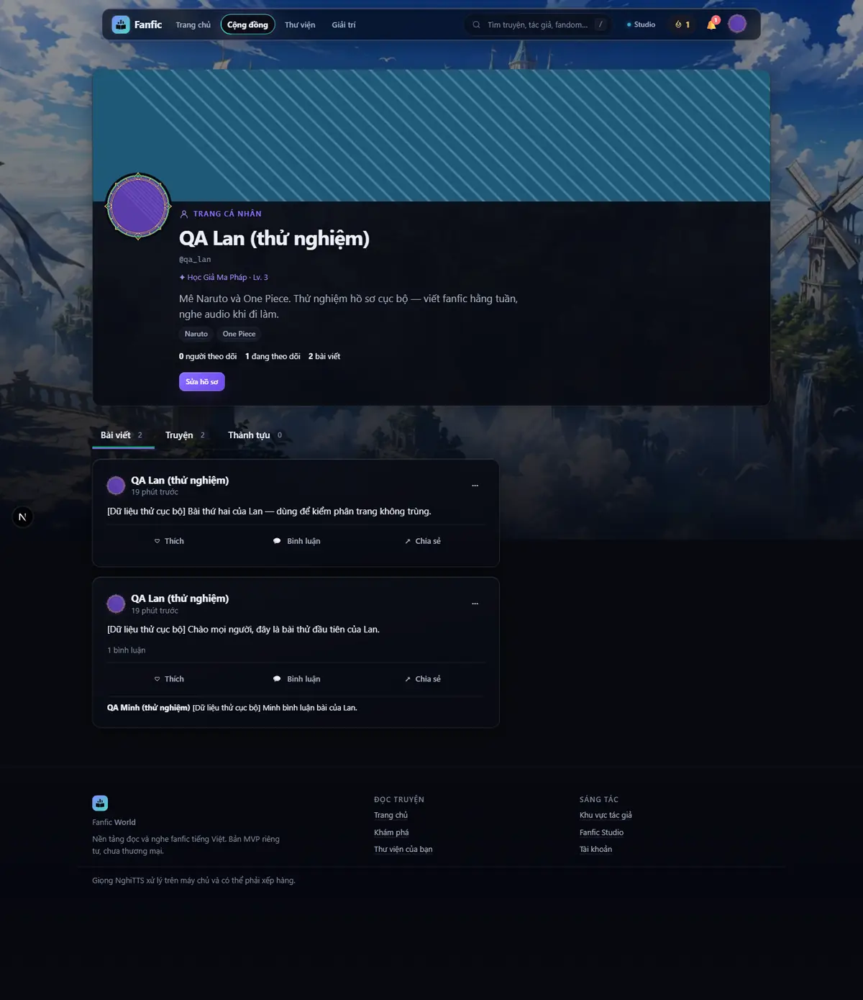 |

## 6. Ảnh Studio

Đã chụp trên production ở §2. Dưới đây là bản sửa ở PR #232, trường hợp `/api/voices` lỗi:

| TRƯỚC: ô giọng trống, không báo lỗi | SAU 1440 | SAU 390 |
|---|---|---|
| 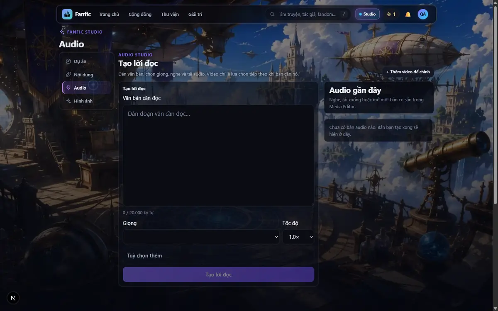 | 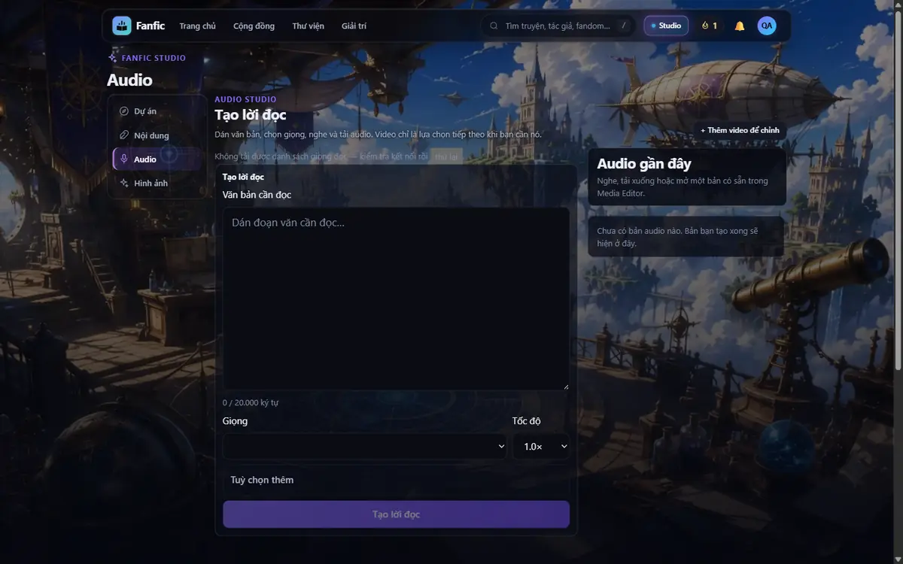 | 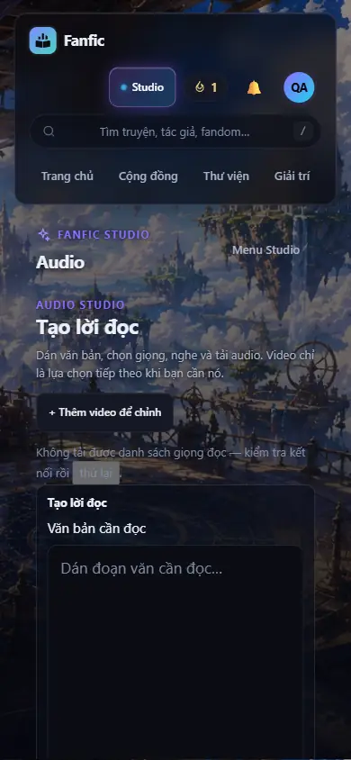 |

Nhận xét thẩm mỹ, không sửa vì nằm ngoài phạm vi sửa lỗi: tiêu đề "Tạo lời đọc" lặp 3 lần; nút "+ Thêm video để chỉnh" nổi ở góc.

## 7. Ảnh Memory / Caro, desktop + di động

Trên PR #231 (`e5a0692`), mock cục bộ, cờ `FAS_GAMES_V1` **chỉ bật ở bản thử**.

| TRƯỚC: hàng có quân cao gấp đôi | SAU: phòng 2 người 390 | SAU: kết quả + XP 390 | SAU: luyện với máy 1440 |
|---|---|---|---|
| 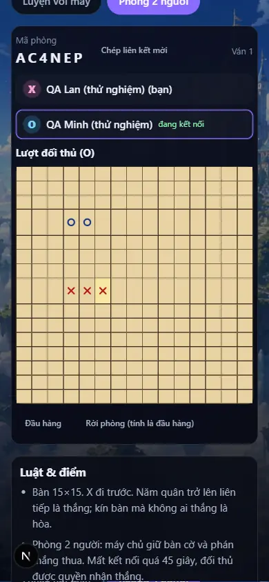 | 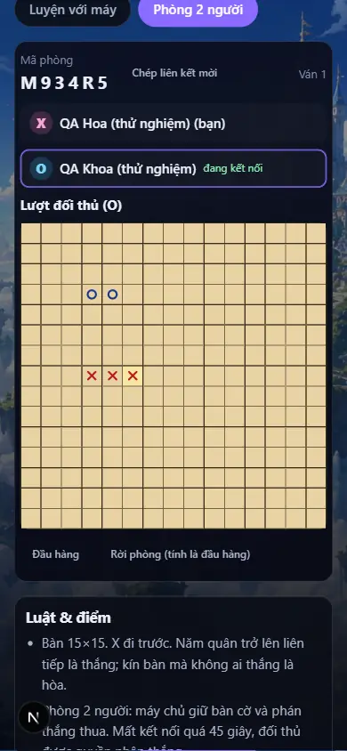 | 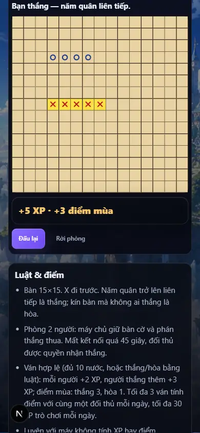 | 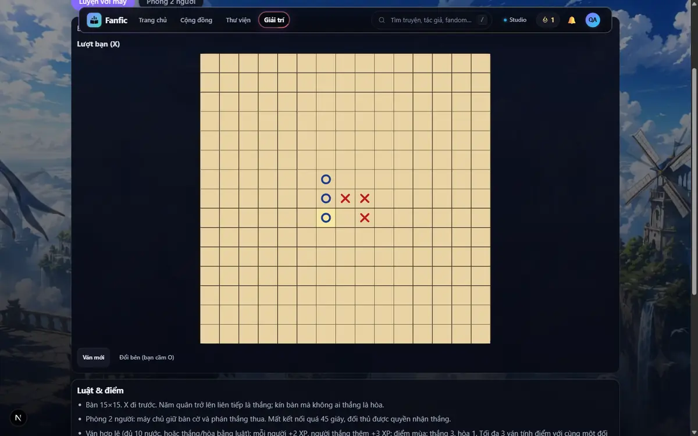 |

| Memory tính điểm 390 (+2 XP **sau** khi máy chủ quyết toán) | Memory luyện tập 1440 (không tính XP, không gửi kết quả) |
|---|---|
| 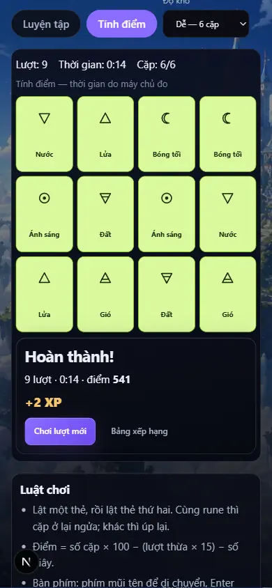 | 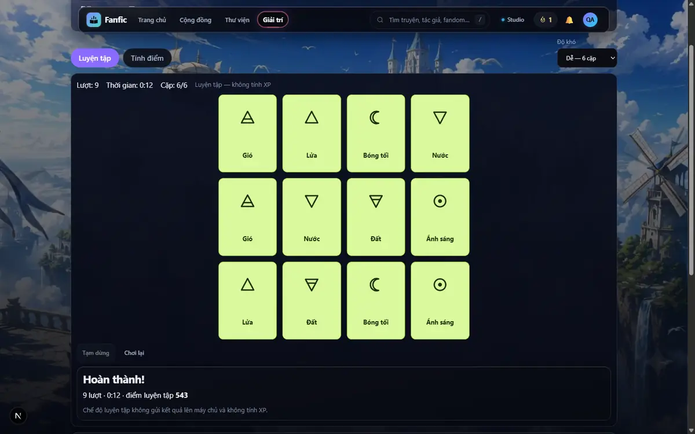 |

Giao diện XP:

- Thẻ kết quả hiện "Đang quyết toán điểm…" cho tới khi máy chủ trả `settlement = settled`, nên không có XP giả trước khi quyết toán.
- Ván bỏ cuộc sớm hiện "Không cộng XP ván này · Ván quá ngắn — không tính điểm."
- Khi cặp chơi vượt trần, thẻ hiện "Đã đủ số ván tính điểm với đối thủ này hôm nay."
- Không có toast trùng.

## 8. PR #229

| | |
|---|---|
| Trạng thái | OPEN, `MERGEABLE`, `mergeStateStatus BLOCKED` |
| Head | **`5f88f1a`** (`feat/social-play-a-community`) |
| CI | Web + gitleaks pass. Backend fail đúng tập 734 lỗi nền của `main` (#223). Khác biệt duy nhất: một test avatar được đổi tên, lỗi y như bản cũ |
| Đêm nay | `5f88f1a`: sửa 4 lỗi giao diện + 4 test |

## 9. PR #231

| | |
|---|---|
| Trạng thái | OPEN, `MERGEABLE`, `mergeStateStatus BLOCKED` |
| Head | Mã: **`e5a0692`** (`feat/social-play-c-games`). Các commit sau đó chỉ thêm báo cáo này (tài liệu + ảnh) |
| CI | Web + gitleaks pass. Backend fail đúng tập 734 lỗi của `main`, theo tên (0 lỗi mới) |
| Đêm nay | `e5a0692`: sửa hàng bàn Caro + 1 test. Mô tả PR đã cập nhật. Báo cáo này nằm trên nhánh này |

PR nhỏ, độc lập (gốc `main@eea7dad`, chỉ web, không trùng tệp với #229/#231):

- **#232** `596fcd4`: danh sách giọng trong Studio.
- **#233** `2e8906f`: trang chủ tải một lần + ảnh nền cỡ điện thoại.

Cả hai đều chưa merge.

CI của hai PR nhỏ:

- #232: backend đỏ, trùng tập lỗi với `main`.
- #233 (`2e8906f`): web + gitleaks pass; backend 4.869 test, đỏ đúng tập 734 lỗi của `main` theo tên (0 lỗi mới).

## 10. Kết quả tích hợp Appwrite

Chi tiết: `docs/reports/SOCIAL_PLAY_V1_APPWRITE_INTEGRATION.md`. Môi trường: Appwrite 1.9.6 + MongoDB, dùng một lần; dữ liệu giả hoàn toàn, lưu trữ cục bộ, không đụng R2 production.

| Bước | Kết quả |
|---|---|
| Schema `main` + dữ liệu cũ | 27/27 |
| Mã mới, cờ tắt, schema cũ | 25/25: trường mới bị từ chối 409, không ghi hỏng dữ liệu |
| Dry-run 847 bước → migration thật | 37 s; tạo 104, bỏ qua 743; 53 collection / 655 thuộc tính / 137 index: 0 thiếu, 0 chưa available |
| `FAS_SOCIAL_V1_SCHEMA=1` | Gói A 47/47 |
| `+ FAS_XP_ATOMIC=1` | HTTP 13/13 + 4/4; tầng dịch vụ 11/11; 108 request đồng thời → 0 lần 401 |
| `+ FAS_GAMES_V1=1` (chỉ bản thử) | Gói C 20/22; 2 mục hỏng do harness, đọc lại 10/10 |
| 2 tiến trình API cùng dùng một Appwrite | 6 trận kết thúc đồng thời, mỗi trận đúng 1 bản ghi cho mỗi người |

**Phase 4 đêm nay:** không dựng lại. Mọi thay đổi đêm nay trên A/C chỉ là giao diện (CSS/TSX/test). Mã backend giữ nguyên từ lần chạy tích hợp (A `399f5fb`, C `01cbac3`).

## 11. Kết quả trên Lightning

- Lightning CPU Studio có sẵn, `scratch-studio-devbox` (4 vCPU, không GPU, không nâng cấu hình), dùng để chạy stack Appwrite thử ở §10.
- Đã dọn container/volume của phiên thử (không `prune`) và **đã tắt** Studio. Kiểm lần cuối lúc 2026-09-26 ~18:30Z: SDK báo `scratch-studio-devbox is Stopped`.
- Dọn máy cục bộ cuối đêm:
  - đã tắt Chrome QA (cổng 9333), các server `next` 3010/3100 và uvicorn mock 8010.
  - **không** chạm daemon Router (8765), worker TTS production chạy cục bộ qua `deploy\windows\run_worker.bat`, hay Chrome của owner.
- Full backend suite **không** chạy trên Windows: chạy trên GitHub CI, 4.869–4.984 test mỗi PR.

## 12. Lỗi mới tìm thấy và đã sửa đêm nay

| Hạng mục | Trước khi sửa | Sau khi sửa |
|---|---|---|
| Xem trước trong trình sửa hồ sơ (#229) | Ô lưới `overflow:hidden` trong hộp tự cuộn bị xẹp còn 1px; nhóm "Ảnh đại diện" đè lên | `.soan-hop-than { grid-auto-rows: max-content }` |
| Khung Gỗ Mộc / Bạc Cổ (#229) | Nét xám, độ sáng 74/77, vô hình trên nền tối | `data-khung` + filter nhuộm gỗ/bạc |
| Bộ đếm ký tự (#229) | "305 ký tự" (không rõ còn hay đã dùng) | "Còn 305 ký tự" (hồ sơ + soạn bài) |
| Chân trang 390px (#229) | Mất padding dọc do shorthand `.wrap` ghi đè | `padding-block` riêng cho footer |
| Studio `/api/voices` (#232) | Lỗi bị nuốt (`.catch(() => ({voices: []}))`); gọi 2 lần | Effect riêng + `role="alert"` + nút thử lại; 1 lần gọi |
| Bàn Caro (#231) | Hàng ngầm `auto`: 19px so với 38px ở 390 | `grid-template-rows: repeat(15, minmax(0, 1fr))`: 600×600 / 344,7×344,7 |
| Trang chủ (#233) | Bộ nạp phụ thuộc `daDangNhap` chạy 2 lần: 17 request | Nguồn công khai tải một lần, nguồn riêng theo `user_id`: 12 request |
| Ảnh nền điện thoại (#233) | Poster `` 1672px + CSS `-sm` 960px: tải cả hai | `<picture>` + `(max-width: 640px)`: một tấm 960px |

Đo nhưng **không phải lỗi**, hoặc đã có sửa ở nơi khác:

- Đấu đôi lần đầu 25/26: kịch bản kiểm thử đọc thẻ của ván 1 trước khi giao diện chuyển sang ván 2. Máy chủ ghi ván 2 = 0 XP đúng luật. Chạy lại có chờ đúng ván: 26/26.
- Sảnh chờ hiện "mất kết nối": đối thủ trong kịch bản chỉ gọi API, không thăm dò định kỳ. Người chơi thật tự cập nhật trạng thái có mặt qua `GET /rooms/{code}`.
- Phòng trên di động lần đầu 5/6: cặp tài khoản Lan/Minh đã hết 3 ván tính điểm trong ngày, đúng luật. Chạy lại với cặp Hoa/Khoa: 6/6.
- `/community` trên `main` gọi trùng `feed` và `search/people`: #229 đã sửa sẵn (sidebar render 1 lần, bảng tin chờ phiên đăng nhập).
- Gọi `/api/audio/{id}/url` 2 lần: do thiết kế (§3).
- Chữ "Đang tải danh mục tác phẩm..." khi danh mục rỗng: câu chữ có từ trước, nhỏ, chưa sửa.

Hiệu năng đo được:

- **Bản production cục bộ** (`next start`, gói C): các trang `/entertainment`, `/caro`, `/memory`, `/leaderboard` có:
  - CLS ≤ 0,0005, LCP 144–616 ms;
  - JS khoảng 193 KB, 0 request trùng.
- **Production, chế độ khách:** 0 request trùng; CLS ≤ 0,0144.
  - `/api/novels` lần đầu 2,8 s, sau đó 0,6–1,2 s.
  - Ở 1440, mỗi trang tải một video nền động 5–10 MB (vd. `02-explore.mp4` 5,2 MB). Đây là tính năng thiết kế chỉ bật trên desktop; owner quyết có giới hạn hay không.

Tác dụng phụ đã báo từ Phase 1: bấm "Chỉnh với video" trên production đã tạo **bản nháp** dự án `vpr_9d142953591e41fc`. Không TTS, không render. Chưa xoá vì cấm xoá dữ liệu production; owner có thể xoá.

## 13. Rào chặn production còn lại (chính xác)

1. **Gói B chưa xanh hẳn**: chưa bấm Phát thẻ Studio khi đăng nhập (§2). Theo lệnh của owner, chưa được bắt đầu migration.
2. **Không truy cập được host Appwrite** `54.179.200.223`:
   - lúc **2026-09-26T18:01:38Z**, TCP 22 → `TIMEOUT 8s` và TCP 443 → `TIMEOUT 8s` từ máy điều hành;
   - máy này không có `aws` CLI, không có credential AWS (đã ghi từ 2026-09-07).
   - Vì vậy không lấy được bản `mongodump --oplog` mới như owner yêu cầu. **Đã DỪNG pha migration**, không đi đường vòng qua máy khác.
3. **Merge #229/#231** cần owner: check backend bắt buộc đang đỏ vì 734 lỗi nền, giống hệt `main` (#223).
4. **Deploy API lên Render** và đặt biến môi trường là việc của owner: agent bị chặn lệnh deploy; `autoDeploy: false`.
5. Migration phải dùng **khoá schema** (`APPWRITE_SCHEMA_API_KEY`, nằm trong tệp env cục bộ). Không để `setup_appwrite` rơi về khoá runtime.
6. **Multiplayer**: `MULTIPLAYER_PRODUCTION_BLOCKED`. `FAS_GAMES_V1` giữ OFF; trần thưởng chỉ mềm khi chạy nhiều instance; cần duyệt riêng.

## 14. Trình tự migration và bật cờ đề xuất

Chỉ chạy khi owner duyệt từng bước. Trước mỗi bước chỉ-owner, agent đưa **đúng một lệnh**.

1. Gói B xanh: owner bấm Phát một thẻ Studio khi đã đăng nhập → `PACKAGE_B_PRODUCTION_VERIFIED`.
2. Merge #229, rồi #231. Phải có #231 vì nó mang bản sửa `setup_appwrite`, tránh kẹt 120 s do cache của Appwrite. #232/#233 merge lúc nào cũng được (chỉ web; owner deploy web bằng `npm run cf:deploy:production`).
3. Deploy API từ `main` đã merge với `FAS_SOCIAL_V1_SCHEMA=off`, `FAS_XP_ATOMIC=off`, `FAS_GAMES_V1=off`. Kiểm `/api/health` → `commit_sha` đúng SHA vừa merge.
4. Xác định **chính xác** host: `i-064abacf35ebe2c8a`, hostname `ip-172-31-35-102`, Appwrite 1.9.6, container Mongo 8.2.5. Xác nhận truy cập được.
5. Sao lưu **mới**, không dùng bản copy đĩa cũ:
   - `mongodump --oplog --archive --gzip` chạy trong container; mật khẩu tham chiếu qua tên biến bên trong `docker exec sh -c`.
   - Ghi lại: đường dẫn artifact, thời điểm UTC, tên database, kích thước, SHA256 trên host và sau khi copy ra ngoài, kiểm toàn vẹn (liệt kê archive / `mongorestore --dryRun`).
6. Rào đích: endpoint `https://appwrite-dev.fanfic.world/v1`, project `fanfic-world-prod`, db `fanfic_world_prod`, khoá schema. Chạy `python -m scripts.setup_appwrite --dry-run`, **in danh sách thuộc tính và index sẽ đổi** cho owner xem.
7. Chạy migration thật. Đối soát từng mục qua `/attributes/{key}` và `/indexes/{key}` (không đọc tài liệu collection): 0 thiếu, 0 chưa available, `target_kind` có `user`.
8. Khởi động lại API.
9. Bật `FAS_SOCIAL_V1_SCHEMA=on` → khởi động lại → smoke Cộng đồng/Hồ sơ bằng tài khoản thử.
10. Bật `FAS_XP_ATOMIC=on` → khởi động lại → smoke XP / phần thưởng / nhiệm vụ.
11. **Dừng ở `SOCIAL_PROFILE_XP_PRODUCTION_VERIFIED`.** `FAS_GAMES_V1` giữ OFF → `MULTIPLAYER_PRODUCTION_BLOCKED`.

**Rollback:**

- Tắt cờ: có hiệu lực ngay; mã chạy đúng khi schema có thuộc tính thừa (25/25).
- Schema để nguyên (chỉ thêm, không sửa).
- Web: `npx wrangler rollback 4899c513-3513-4bdb-a839-9846eb26899f` (về bản trước gói B).

## 15. Đúng MỘT việc tiếp theo cho owner

Mở Studio khi đã đăng nhập, bấm **Phát** một thẻ audio khoảng 5 giây, rồi báo lại "phát được" hay "không":

```
start https://fanfic.world/studio/audio
```

Việc này đóng §2 thành `PACKAGE_B_PRODUCTION_VERIFIED`. Đó là điều kiện đầu tiên owner đặt ra trước khi bắt đầu migration.

---

**`SOCIAL_PLAY_V1_PARTIALLY_READY`**

- **Đã sẵn sàng:** mã A/C đã kiểm trên Appwrite thật; #229/#231/#232/#233 đều MERGEABLE với 0 lỗi CI mới so với `main`; B đã live.
- **Chưa sẵn sàng:** B còn một bước chưa chạy; migration production bị chặn vì không truy cập được host Appwrite.
