# Social & Play V1 — PR A: Cộng đồng + Hồ sơ tuỳ chỉnh

Trạng thái: **READY_FOR_OWNER_REVIEW** cho phạm vi dưới đây. Chưa merge, chưa
deploy, chưa migrate production. Tính năng dựa trên schema mới nằm sau cờ
`FAS_SOCIAL_V1_SCHEMA` (mặc định TẮT).

- Base: `origin/main` @ `3f046e8` (worktree sạch `C:/FanficWorkers/social-play-v1`,
  không nhánh từ checkpoint Content Factory).
- Nhánh: `feat/social-play-a-community`.

## 1. Trước / sau

| Hạng mục | Trước khi sửa | Sau khi sửa |
|---|---|---|
| Đầu trang Cộng đồng | Khối hero cao ~132px, cột bài lệch trái, bên phải trống | Tiêu đề gọn, cột đọc 680px ở giữa + cột phụ 300px (≥1024px); một cột trên điện thoại |
| Lọc bảng tin | Một dòng trộn, không tab, không fandom | Tab **Mới nhất / Đang theo dõi** + chip fandom, sống trên URL (`?tab=…&fandom=…`) |
| Phân trang | Offset, không trần độ sâu | Cursor tất định `(created_at, post_id)`, gộp không trùng, trần 500 mục có báo rõ |
| Bài mới | Không có | Báo "Có N bài mới — bấm để xem", không chen lên dưới mắt người đọc |
| Back từ bài/hồ sơ | Mất vị trí, mất khối bình luận đang mở | Giữ bộ lọc, vị trí cuộn, bình luận đang mở (đo thật: 700px → 700px) |
| Soạn bài | Form mở ngay trong bảng tin, mất chữ khi lỗi | Hộp thoại / tấm trượt (mobile), bản nháp lưu cục bộ, xem trước, spoiler, fandom |
| Đăng hai lần | Có thể (bấm đúp / thử lại sau mất mạng) | Khoá `client_key` → máy chủ trả lại đúng bài cũ (`replayed`) |
| Thích | Lạc quan nhưng bấm dồn gửi chồng yêu cầu | Khoá trong lúc chờ, hoàn lại + báo lỗi khi máy chủ từ chối |
| Spoiler bài đăng | Không có (chỉ bình luận chương) | Che thân bài, nút "Hiện nội dung" cố ý |
| Nhãn đã sửa | Không có | "· đã chỉnh sửa" chỉ khi TÁC GIẢ sửa chữ (`edited_at`), lượt thích không làm bật |
| Xoá bài / bình luận | Xoá ngay khi bấm; lỗi xoá bình luận ném không bắt | Hộp xác nhận, lỗi nói rõ |
| Báo cáo người dùng / chặn / ẩn | Không có | Báo cáo người dùng; chặn (hai chiều, cấm tương tác) và ẩn (một chiều) — cưỡng chế ở máy chủ; quản lý trong `/account` |
| Liên kết tới hồ sơ | Chỉ khi có username (tác giả production không có username → không bấm được) | `/u/{username}` hoặc `/u/{user_id}` bất biến; avatar cũng dẫn tới hồ sơ |
| Hồ sơ | Không bìa, không màu nhấn, 2 tab | Ảnh bìa, màu nhấn (5 preset), fandom yêu thích, tab Bài viết / Truyện / Thành tựu, menu báo cáo/ẩn/chặn |
| Sửa hồ sơ | Rải rác ở `/account` | Trình sửa có xem trước, cắt/phóng avatar (chuột, chạm, bàn phím), hỏi lại khi còn thay đổi chưa lưu, lưu một lần (được cả hoặc không gì) |
| Ảnh tải lên | Máy chủ chỉ `base64.decode` rồi lưu | Máy chủ GIẢI MÃ thật (Pillow), chặn ảnh động / bom giải nén (24 MP) / ảnh giả, xoá EXIF/GPS, mã hoá lại WebP 512×512 / 1500×500, khoá lưu trữ do máy chủ đặt theo băm nội dung |
| Khung avatar | Chỉ ở bình luận + hồ sơ | Một component `UserAvatar` cho thanh điều hướng, bài, bình luận, hồ sơ, bảng xếp hạng; có "Không khung"; máy chủ kiểm quyền sở hữu |
| Hộp thoại (báo cáo, xác nhận) | Nền trong suốt (`--card`/`--r-lg` chưa định nghĩa); lớp phủ không phủ hết màn vì `.page` có `transform` | Nền đặc; portal ra `document.body` |

Ảnh (khung nhìn top-level giả lập bằng CDP trong Chrome hiển thị — không phải
iframe; nội dung thật của người dùng trong ảnh "trước" đã làm mờ vì repo công khai):

| | |
|---|---|
| Trước 1440 | 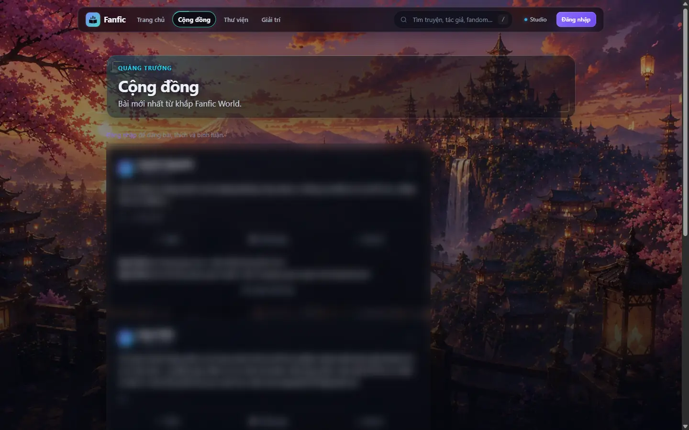 |
| Sau 1440 (khách) | 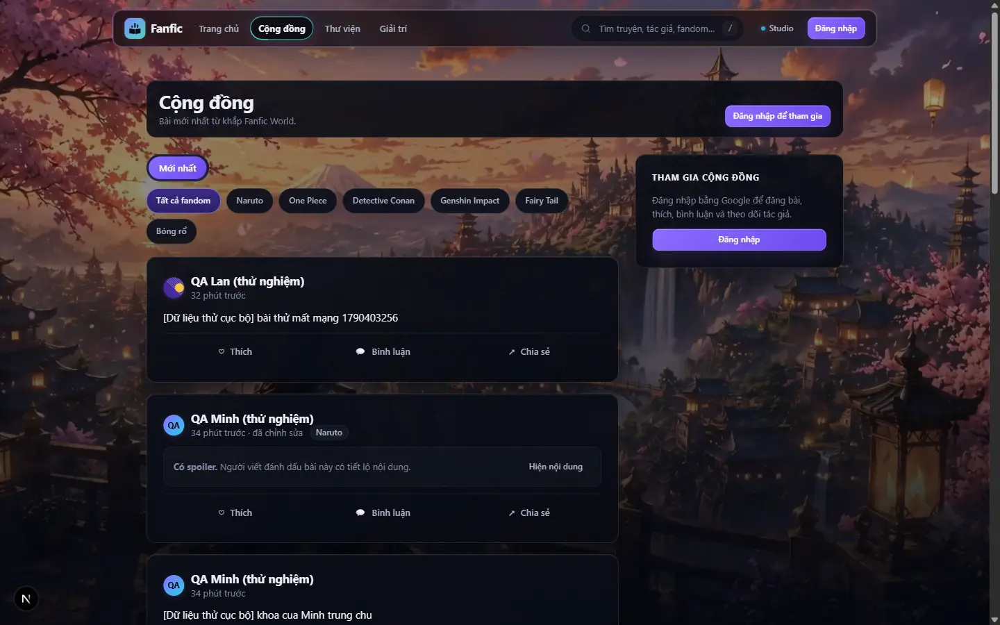 |
| Sau 1440 (đã đăng nhập) | 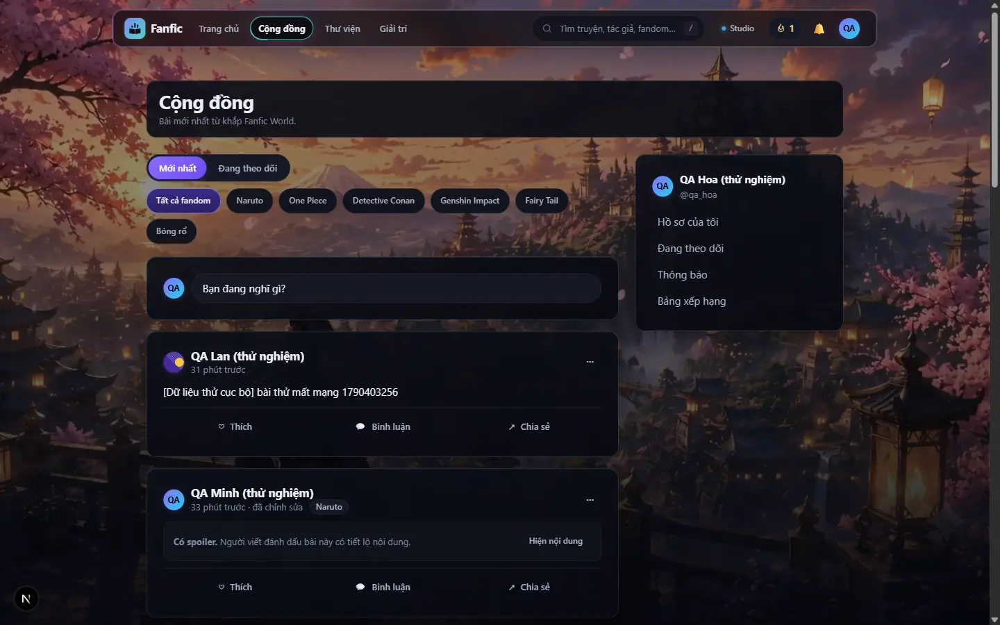 |
| Trước 390 | 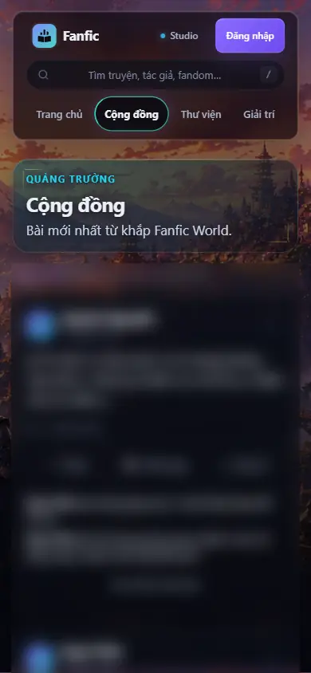 |
| Sau 390 / 360 / 768 | 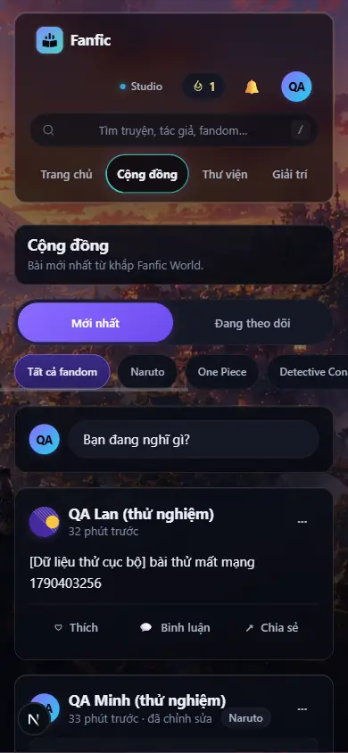 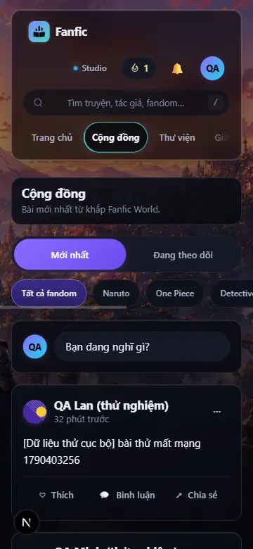 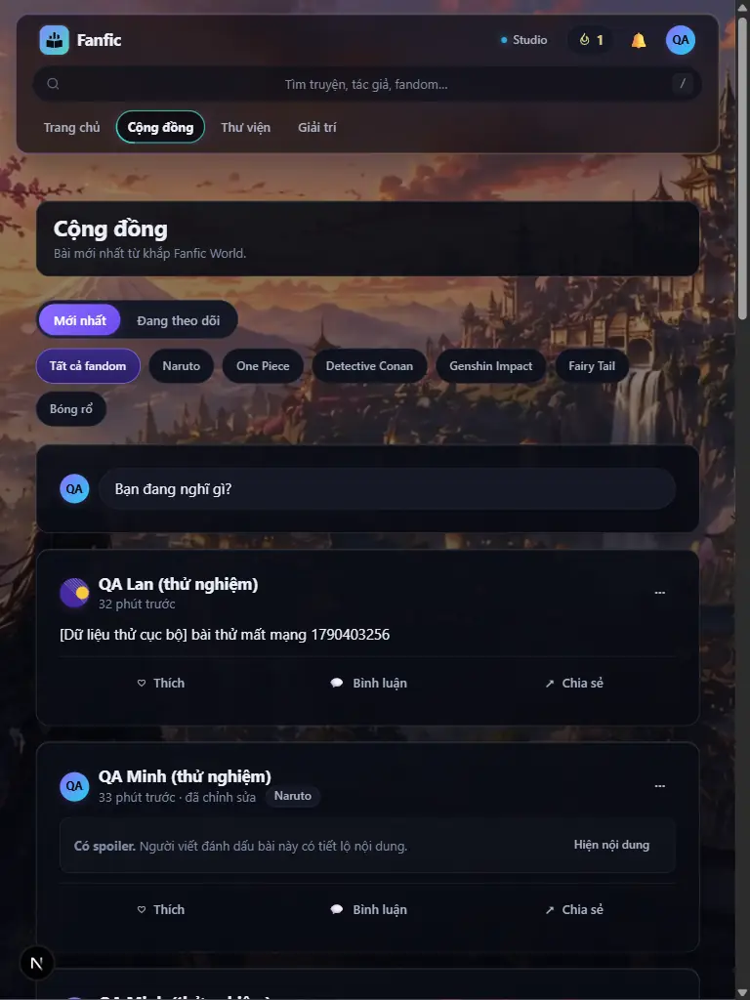 |
| Soạn bài 1440 / 390 | 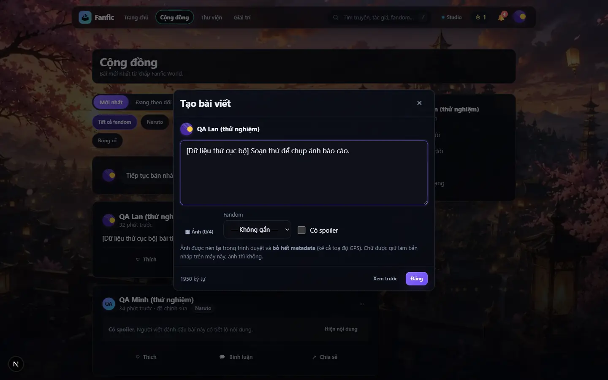 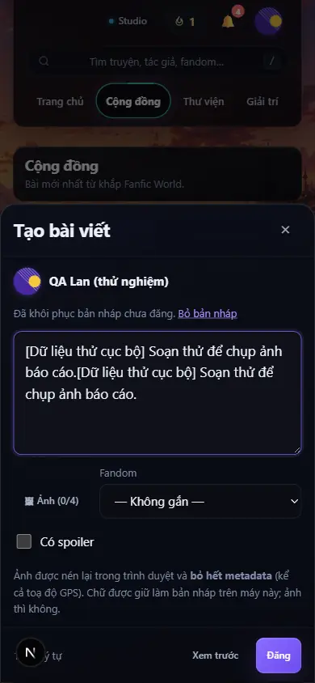 |
| Hồ sơ sau khi lưu (chủ / khách / 390) | 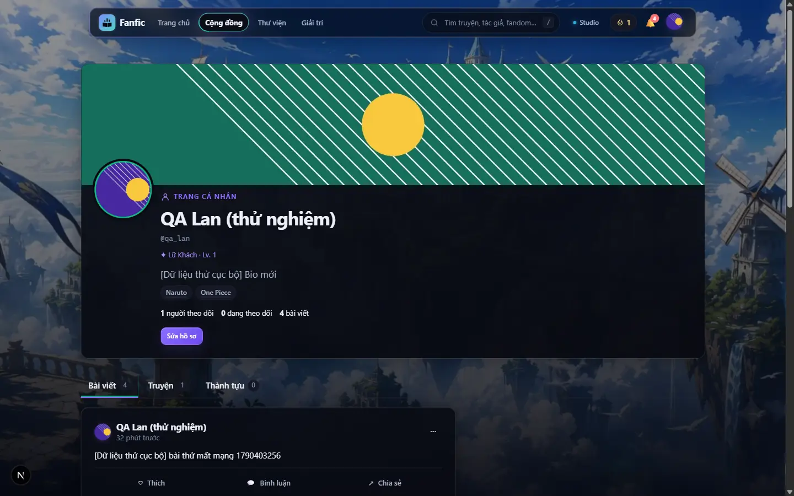  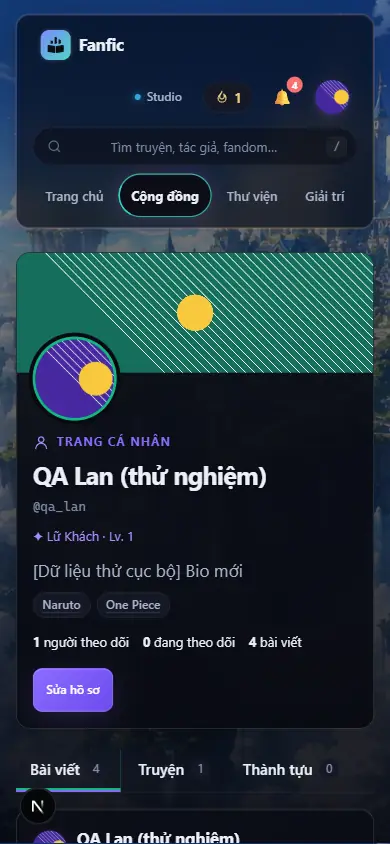 |
| Trình sửa + cắt avatar | 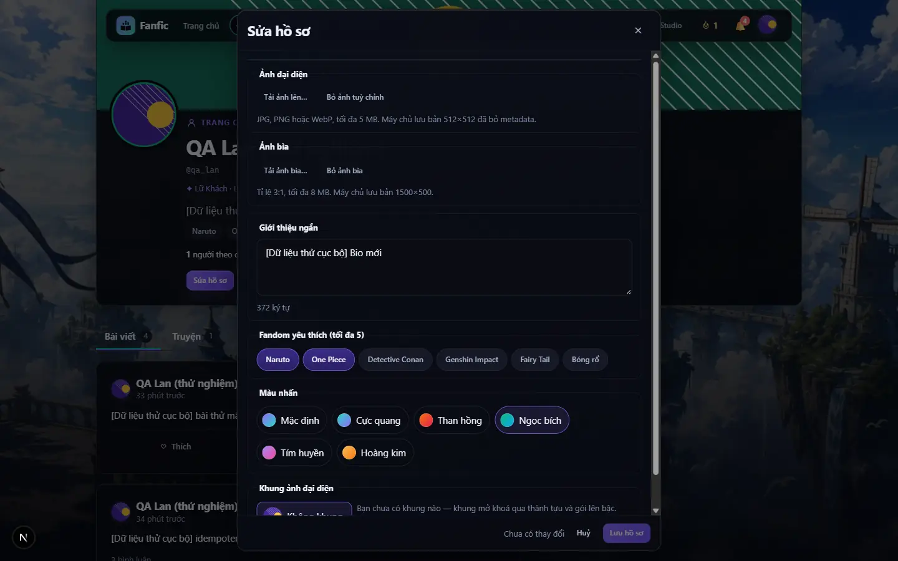 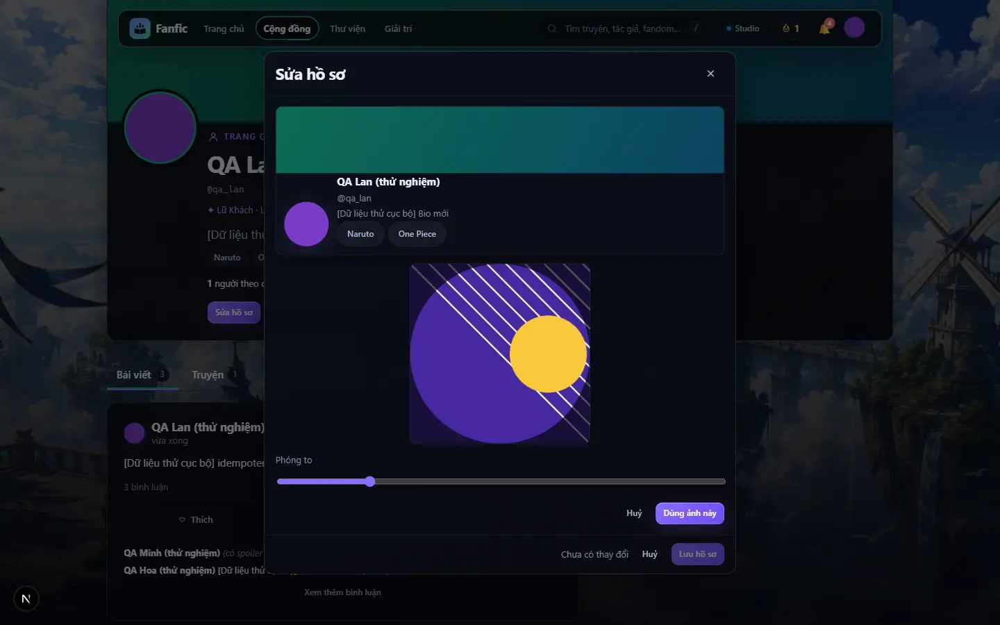 |

## 2. Đã kiểm thật (dữ liệu thử cục bộ, backend mock, tách biệt production)

Người dùng thử tạo bằng `scripts/dev_social_play_seed.py` (chỉ chạy khi
`/api/health` báo mock; mật khẩu sinh ngẫu nhiên, lưu ở `server/var/` đã
git-ignore). Nội dung đều mang nhãn "[Dữ liệu thử cục bộ]".

| Kịch bản | Cách | Kết quả |
|---|---|---|
| API end-to-end (2–3 người dùng thật qua HTTP) | idempotent bài/bình luận, spoiler/fandom/đã sửa, cursor không trùng, following/fandom, feed cũ, ẩn/chặn hai chiều, báo cáo người dùng, hồ sơ theo id/username, không lộ email, lưu hồ sơ được-cả-hoặc-không, ảnh SVG giả bị từ chối, khung chưa sở hữu bị từ chối | **41/41** |
| Trình duyệt, chuột CDP thật | mất mạng (chặn `/api/posts`) → nháp còn + báo lỗi + máy chủ 0 bài; mở mạng + bấm đúp → đúng 1 bài; thích bị từ chối → hoàn lại; Chia sẻ → mở đúng `/posts/{id}` | **8/8** |
| Back giữ trạng thái | mở bình luận, cuộn 700px, bấm tên tác giả, Back | **PASS** (700 → 700, bình luận vẫn mở) |
| Trình sửa hồ sơ | tệp JPEG thật có GPS, kéo khung cắt bằng chuột, phóng, ảnh bìa, màu nhấn, fandom, hỏi lại khi huỷ, lưu, tải lại trang | **12/12** |
| Ảnh đã lưu | đọc lại bằng Pillow | WebP 512×512 và 1500×500, **0 thẻ EXIF**; URL ký bị sửa → 404 |
| Quản lý chặn trong `/account` | Minh chặn Lan → thấy trong danh sách → bấm "Bỏ chặn" thật | **3/3** |
| Web mới + API cũ (`origin/main` chạy cục bộ) | lùi về offset, ẩn tab theo dõi, URL lọc báo "chưa hỗ trợ" | **7/7** |
| Tấm trượt 390 | chạm thật (`Input.dispatchTouchEvent` + giả lập cảm ứng) | mở, focus vào ô chữ, khoá cuộn nền, bám đáy 844/844 |

## 3. Kiểm thử tự động

| Bộ | Lệnh | Kết quả |
|---|---|---|
| Web (toàn bộ) | `npm test` | 1088 đạt / 0 hỏng / 6 bỏ qua (6 bỏ qua có từ trước) |
| TypeScript | `npm run typecheck` | 0 lỗi |
| ESLint | `npm run lint` | 0 lỗi, 6 cảnh báo (đều có từ trước, không thuộc tệp của PR này) |
| Build production | `npm run build` | thành công |
| Backend liên quan | `python -m unittest` 20 bộ (social*, social_play_v1_*, image_normalize, avatar, public_profile*, gamification_contract, appwrite_v2_contract, env_loading, dependencies, account_*, rate_limiting) | 552 đạt |
| Backend riêng | `test_api`, `test_oauth`, `test_adapters` (chạy riêng: giới hạn tần suất dùng chung trạng thái tiến trình — có từ trước) | đạt |
| Test mới | `test_image_normalize`, `test_social_play_v1_{feed,moderation,profile,capability_off,security}`, `community-feed`, `profile-image` | đạt |

Test cũ được sửa có chủ đích (bất biến giữ nguyên hoặc chặt hơn, không nới):
`social.test.mjs` (offset → cursor; composer thành hộp thoại; thích có khoá),
`avatar-*.test.mjs` (đường chung `UserAvatar`), `test_avatar.py` (ảnh giờ được
giải mã thật — dữ liệu rác vẫn 400), `test_social_service.py` (`user` giờ là
loại báo cáo hợp lệ). Test `static-link-prefetch` bắt được lỗi thật (liên kết
mới thiếu `prefetch={false}`) → đã sửa mã, không sửa test.

## 4. Review bảo mật chéo họ model

Antigravity **Claude Opus 4.6** (qua `scripts/ai_router_dispatch.py`,
`SECURITY_REVIEW`, không Codex). Không có mức critical. Xử lý:

| Phát hiện | Đánh giá | Xử lý |
|---|---|---|
| Trần giải mã 40 MP → ~160 MB/ảnh | đúng | hạ xuống **24 MP** |
| `update_profile` không hoàn tác Profile trong bộ nhớ khi ghi hỏng | đúng | chụp + hoàn tác, có test |
| Khoá `capabilities` thiếu mặc định là BẬT | đúng | thiếu = TẮT, có test |
| Bỏ qua hạn mức bằng dấu `/` cuối | **không đúng** — `classify_request` đã `rstrip("/")` | không đổi |
| Race `client_key` làm mồ côi ảnh | **không xảy ra** — khoá ảnh sinh từ `post_id` tất định | không đổi |
| `_path` dựa vào kiểm tra `..` | gia cố thêm: đường tuyệt đối `C:/…` trên Windows | `resolve()` + kiểm nằm trong gốc, có test |

Tự review thêm và sửa: (1) khi cờ tắt, bảng tin/theo dõi/thích/bình luận
**không được đọc** collection `user_blocks` hay cột `fandom_id` chưa tồn tại
— nếu không, ngay khi deploy lên production (chưa migrate) mọi bảng tin của
người đã đăng nhập sẽ hỏng; (2) `Pillow` chưa được khai báo trong
`server/requirements.txt` trong khi được import lúc khởi động — đã khai báo,
có test; (3) cửa sổ đếm theo giờ của giới hạn lưu hồ sơ bị bộ dọn dẹp 60s xoá
sớm — đã sửa, có test.

## 5. Hạ tầng / schema / migration (CHƯA chạy)

Xem `docs/migrations/SOCIAL_PLAY_V1_SCHEMA.md`: thêm `posts.spoiler/fandom_id/edited_at`,
`comments.edited_at`, `profiles.banner_key/accent/fandom_ids`, enum
`content_reports.target_kind` + `user`, collection `user_blocks` + index. Dry-run:
`python -m scripts.setup_appwrite --dry-run` (chạy sạch cục bộ, không chạm
Appwrite). Thứ tự: deploy API (cờ tắt) → dry-run → migrate → đối soát → cờ bật
→ deploy web. Rollback: tắt cờ. Không có chi phí mới.

Biến môi trường mới: `FAS_SOCIAL_V1_SCHEMA` (mặc định tắt), `FAS_PUBLIC_API_BASE`,
`FAS_DEV_MEDIA_URLS` (chỉ dev cục bộ, mặc định tắt), `FAS_RATE_LIMIT_PROFILE_PER_HOUR`
(mặc định 30).

## 6. Chưa làm / bị chặn / chưa kiểm — nói rõ

- **"Khôi phục ảnh Google"**: hệ thống chưa bao giờ lưu ảnh Google của ai; muốn
  có phải đọc token của nhà cung cấp — ngoài phạm vi. Nút hiện có là "Bỏ ảnh tuỳ
  chỉnh" (về chữ cái đầu) và nói đúng như vậy.
- **Truy vấn Appwrite thật** (cursor `or/and/lessThan`, lọc fandom): chỉ kiểm qua
  FakeAppwrite → **UNVERIFIED** tới khi smoke sau migration.
- Chặn/ẩn chưa áp dụng cho bình luận chương/tập animation.
- Trang quản trị chưa có màn xem báo cáo người dùng riêng (báo cáo vào cùng hàng
  đợi `content_reports`, `target_kind=user`).
- Giới hạn tần suất là bộ đếm trong tiến trình (có từ trước) — nhiều instance
  thì mỗi instance đếm riêng.
- Chưa QA trên production (chưa deploy). Cờ tắt thì production không thấy gì
  mới ngoài giao diện và các sửa lỗi.

## 7. Kiểm tra nhanh cho chủ dự án (sau khi deploy API + migrate + bật cờ + deploy web)

1. Vào `/community` khi chưa đăng nhập: thấy bài, tab Mới nhất, chip fandom, không có nút ⋯.
2. Đăng nhập, bấm "Bạn đang nghĩ gì?", viết, tắt mạng, bấm Đăng → chữ còn, báo lỗi; bật mạng, Đăng → 1 bài.
3. Bấm tên một tác giả → hồ sơ `/u/…`; Back → đúng chỗ cũ.
4. Hồ sơ của mình → Sửa hồ sơ → đổi avatar (cắt), ảnh bìa, màu nhấn → Lưu → tải lại: còn nguyên; avatar trên thanh điều hướng đổi theo.
5. Trên hồ sơ người khác: ⋯ → Ẩn / Chặn; `/account` → "Đã chặn và đã ẩn" → Bỏ chặn.
