# SOCIAL & PLAY V1 — Gói B: Studio, ẩn nhạc có thể bật lại, khung Giải trí

- Nhánh: `feat/social-play-b-studio-music`, gốc `3f046e8` (`main`, sau #228). Không phụ thuộc PR A (#229).
- Phạm vi: chỉ web (`web/`). **Không đổi backend, không schema, không migration, không phụ thuộc mới.**
- Trạng thái: **READY_FOR_OWNER_REVIEW** cho phạm vi dưới đây. Điểm/XP cho game và phòng chơi hai người là gói C — **chưa làm ở đây**, thẻ game nói thẳng "Không tính XP".

## 1. Đã làm

| Hạng mục | Trước khi sửa | Sau khi sửa |
|---|---|---|
| Nhạc toàn site | Ticker lời bài hát ở layout, khung sóng nhạc ở header, sóng mini ở nav, trình phát + danh sách bài ở `/entertainment`, `window.musicStore` luôn có | MỘT cờ build `NEXT_PUBLIC_MUSIC_ENABLED` (`web/src/lib/features.ts`, mặc định TẮT). Tắt: không ticker, không khung sóng, không trình phát, không `musicStore` trên `window`, không đăng ký kênh `ambient` với audioFocus, `play/togglePlay/startTrack` không làm gì |
| Dữ liệu/mã nhạc | — | **Không xoá gì.** Trình phát tách nguyên văn sang `components/entertainment/MusicSection.tsx`; danh sách bài, tệp nhạc, `musicStore` giữ nguyên. Bật cờ + build lại là quay về y như cũ (đã đo, mục 3.3) |
| Trang `/entertainment` | Mặc định tab "Âm nhạc", mini-game nằm ở tab thứ hai, không nói game có tính điểm hay không | Hub "Chơi ngay": mỗi thẻ ghi Chế độ / Người chơi / Thời lượng / Phần thưởng thật ("Không tính XP" cho hai game 3D tĩnh vì chúng không nói chuyện với máy chủ). Iframe CHỈ gắn khi bấm "Chơi ngay", gỡ hẳn khi "Đóng game". Mở game tạm dừng lời đọc đang phát. Liên kết Bảng xếp hạng / Thành tựu thật. Dòng "Âm nhạc — sẽ quay lại sau." |
| Trang chủ — thẻ lối tắt | "Âm Nhạc — Fantasy ambient & bài hát", icon tai nghe | Khi nhạc tắt: "Giải trí — Mini-game & bảng xếp hạng", icon tay cầm (SVG nội tuyến của kho, không Icons8) |
| Audio Studio — thứ tự ô | Ô "Tiêu đề" đứng đầu, văn bản thứ hai | Văn bản là ô chính (đầu tiên, cao hơn, bộ đếm ký tự gắn `aria-describedby`); giọng + tốc độ; tiêu đề nằm trong "Tuỳ chọn thêm" (thu gọn) |
| Audio Studio — bấm đúp / thử lại | Hai lần bấm nhanh có thể chạy qua trước khi `setCreating` kịp vẽ lại | Khoá `dangGui` trong cùng nhịp; thử lại cùng (tiêu đề, văn bản, giọng, tốc độ) DÙNG LẠI chương đã tạo → máy chủ trả lại đúng job đang chạy (dấu vân tay), job `failed` thì cho tạo mới; đổi giọng/tốc độ → chương mới |
| "Audio gần đây" | Thẻ không có tên, không giọng, "0:00 / --:--", chữ "Nghe" chung chung, mỗi thẻ một `<audio>` riêng | Thẻ có tên, giọng (nhãn chính tắc), "x phút trước", thời lượng THẬT (`duration_seconds`), Phát qua động cơ lời đọc toàn cục (một `<audio>` duy nhất), Tải MP3 lấy URL lúc bấm, "Chỉnh với video". Trống thì nói thật "Chưa có bản audio nào" |
| Tiêu đề tự sinh | `vanBan.slice(0, 40)` — cắt giữa chữ ("Gió đê") | `tieuDeTuVanBan()` cắt ở ranh giới từ ≤ 48 ký tự + "…" (bản cũ đã lưu giữ nguyên tên cũ) |
| Độ đọc chữ trên tranh nền | Mô tả "Audio gần đây" và lời giới thiệu chìm vào khinh khí cầu | Nền đặc nhẹ cho đầu cột, bóng chữ cho lời giới thiệu |

## 2. Ảnh trước/sau

Ảnh "trước" của Giải trí là production (khách, không có dữ liệu người dùng). Ảnh "trước" của Studio chụp từ mã gốc `3f046e8` chạy cục bộ trên **cùng backend thử + cùng dữ liệu thử** với ảnh "sau".

| Hạng mục | Trước khi sửa | Sau khi sửa |
|---|---|---|
| Giải trí 1440 | 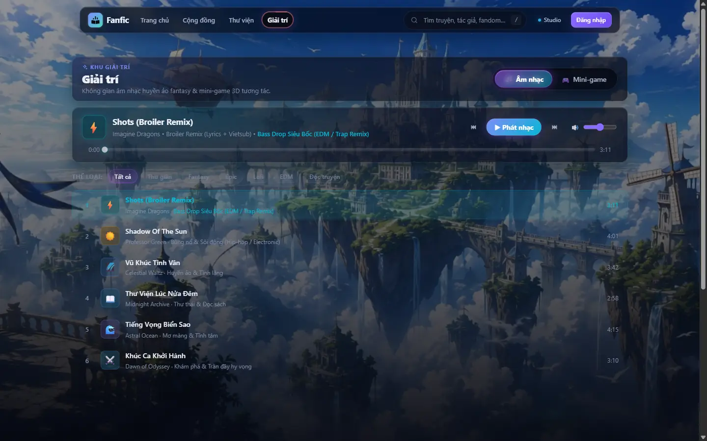 | 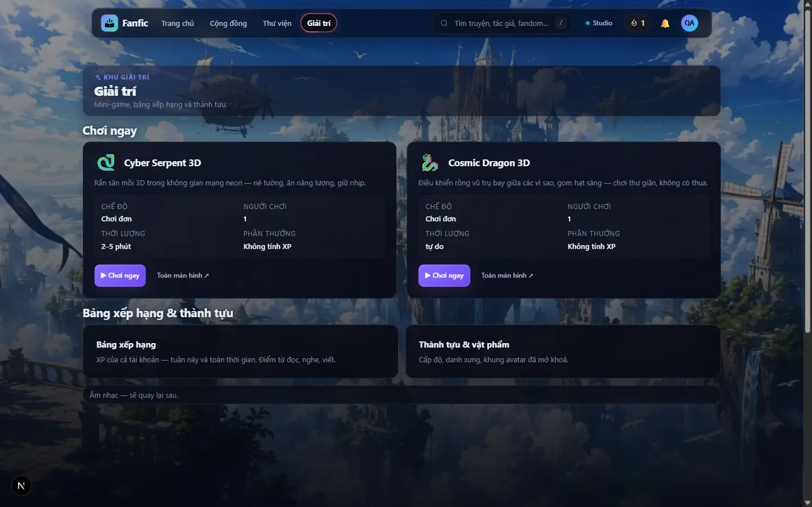 |
| Giải trí 390 | 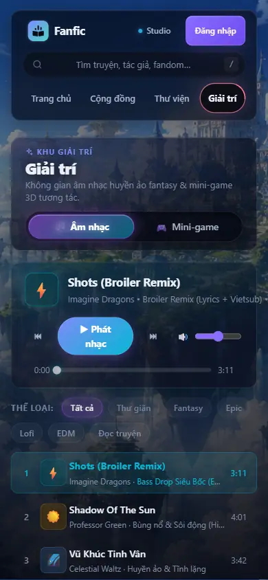 | 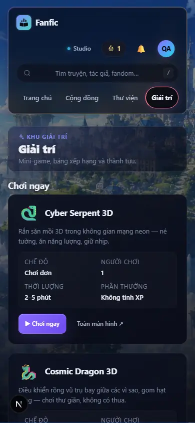 |
| Đang chơi (1440 / 390) | — | 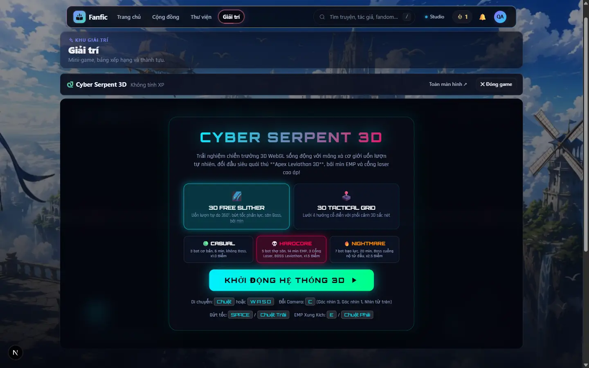 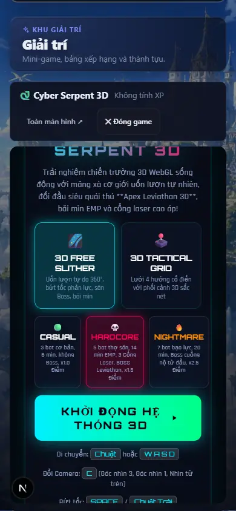 |
| Bật nhạc lại (`NEXT_PUBLIC_MUSIC_ENABLED=1`) | — | 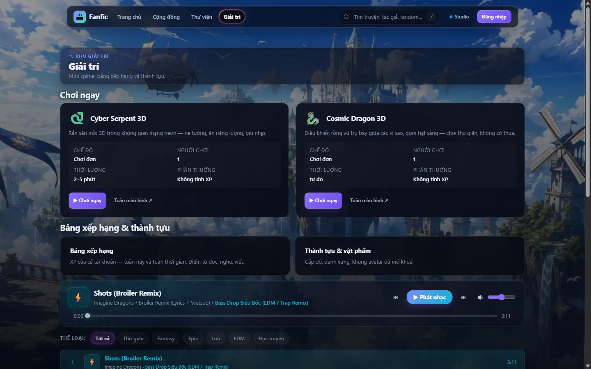 |
| Audio Studio 1440 | 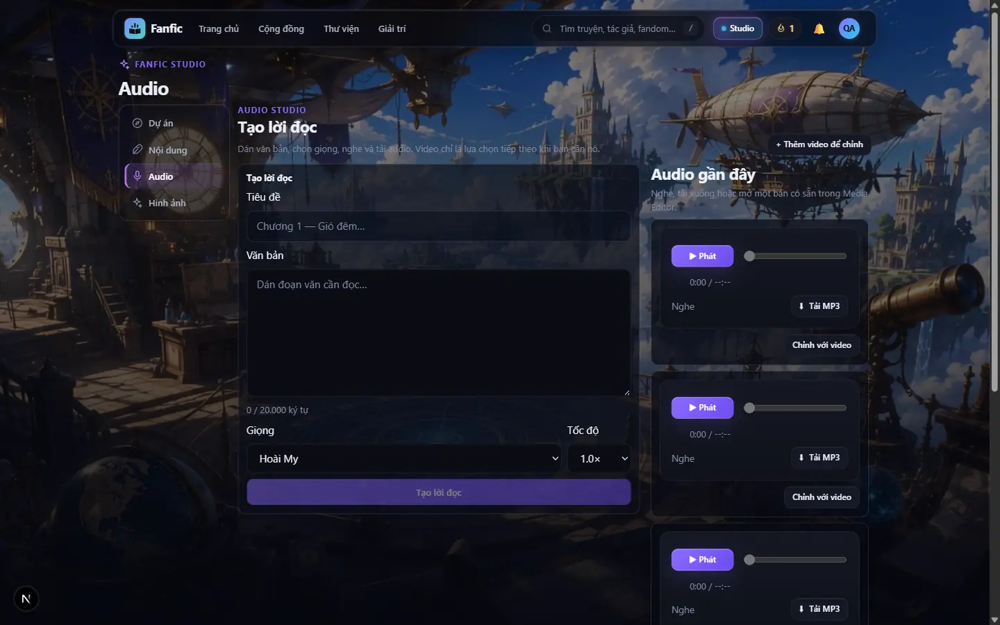 | 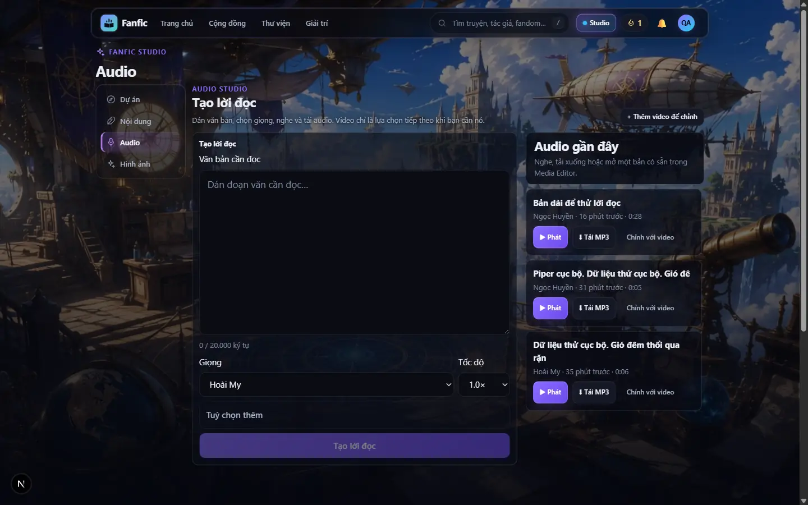 |
| Audio Studio 390 (cả trang) | 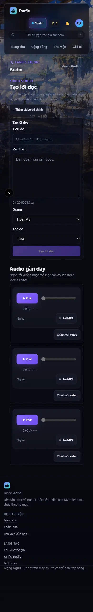 | 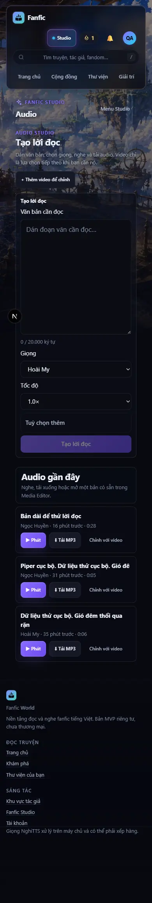 |
| Piper cục bộ vừa xong | — | 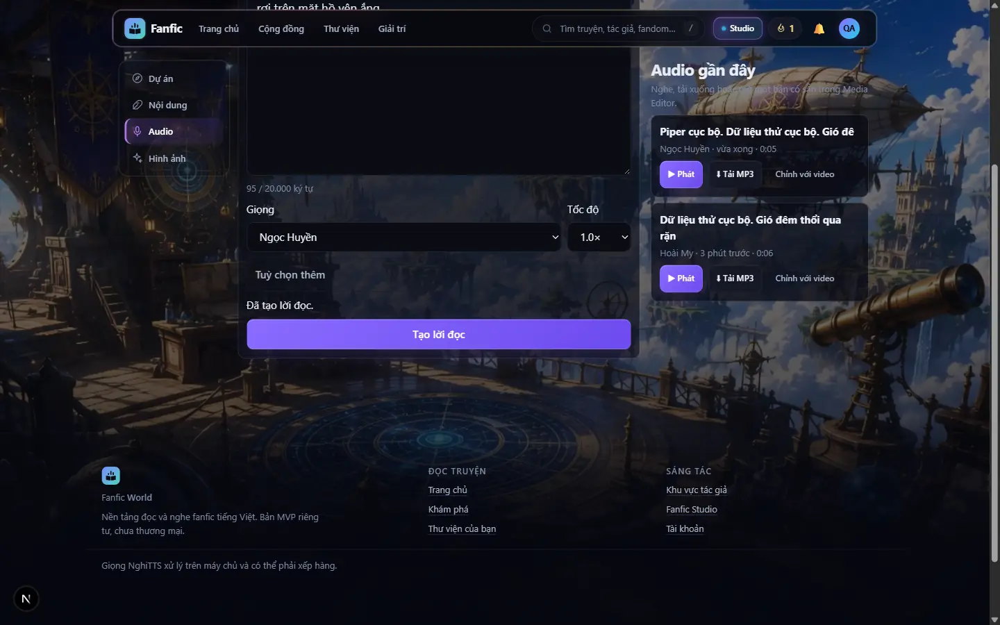 |
| Thẻ trang chủ | Âm Nhạc + tai nghe |  |

## 3. Kiểm thử

Môi trường: backend `DATA_BACKEND=mock` + lưu trữ cục bộ + worker trong tiến trình (cổng 8010, thư mục `server/var/social-play-b`, không chạm Appwrite/R2 production), web dev cổng 3010, tài khoản thử `qa_hoa` do `scripts/dev_social_play_seed.py` tạo. Chrome hiển thị (headed) duy nhất, chuột/chạm CDP thật; khung nhìn đặt ở tầng trang (Emulation), không iframe.

### 3.1 Audio Studio — gửi tới kết quả (E2E thật)

| Bước | Kết quả |
|---|---|
| Trạng thái đầu, chưa có bản nào | PASS — dòng trống thật, không trình phát giả |
| Bấm ĐÚP "Tạo lời đọc" | PASS — đúng **1** job trên máy chủ |
| Job `running → completed` bằng **Piper cục bộ** `piper:ngochuyennew` | PASS |
| Thẻ kết quả: tên + "Ngọc Huyền" + thời lượng thật (0:05) | PASS |
| Bấm "Phát" → động cơ toàn cục phát, một `<audio>` duy nhất | PASS |
| Bấm "Tải MP3" → tệp MP3 thật về máy (48 648 B) | PASS |
| Mất mạng khi tạo (chặn `/api/chapters`, `/api/jobs`) → chữ còn nguyên, báo lỗi, không có thẻ "thành công" mới | PASS |

**7/7 PASS** với Piper cục bộ. **Ghi rõ:** lần chạy đầu tiên dùng giọng MẶC ĐỊNH (Hoài My = `edge:vi-VN-HoaiMyNeural`, `VERIFIED_VOICE_ID` — không đổi so với `main`), nên một chuỗi thử có nhãn "Dữ liệu thử cục bộ…" đã được gửi tới dịch vụ Edge TTS công khai miễn phí của Microsoft. Không tốn phí, không dữ liệu người dùng thật; từ đó mọi lần chạy dùng Piper cục bộ. Chưa kiểm: job thất bại PHÍA MÁY CHỦ (`status=failed`) — chỉ kiểm lỗi mạng phía trình duyệt.

### 3.2 Giải trí — bấm thật ở 5 khung nhìn

| Khung | Mở game (iframe gắn, tải xong, có canvas) | Vừa khung, không tràn ngang | Đóng → gỡ iframe |
|---|---|---|---|
| 1440×900 | PASS | PASS (1131×611) | PASS |
| 1366×768 | PASS | PASS (1131×521) | PASS |
| 768×1024 | PASS | PASS (703×679) | PASS |
| 390×844 (chạm) | PASS | PASS (357×589) | PASS |
| 360×780 (chạm) | PASS | PASS (327×545) | PASS |

**20/20 PASS.** Lời đọc + game: phát một bản Piper dài 0:28 ở Studio → bấm "Giải trí" trên header (điều hướng nội bộ) → lời đọc **vẫn phát**, không có nhạc chen vào → bấm "Chơi ngay" → lời đọc **tạm dừng**, game mở — **4/4 PASS**. Bấm "Toàn màn hình ↗" (mở game ở tab mới) cũng tạm dừng lời đọc — **PASS** (sau sửa review, mục 3.5).

### 3.5 Review chéo khác họ model

Qua `scripts/ai_router_dispatch.py --task-class ORDINARY_REVIEW --risk LOW` → Codex (`gpt-5.6-sol`), gói là diff thật (bỏ phần di chuyển nguyên văn `MusicSection.tsx`), không lịch sử hội thoại, không bí mật. Kết quả `ISSUES`, 2 phát hiện — **cả hai đúng, đã sửa và đo lại bằng chuột thật**:

| Hạng mục | Trước khi sửa | Sau khi sửa |
|---|---|---|
| (Cao) Khoá dùng lại chương chỉ gồm tiêu đề + văn bản | Cùng văn bản, đổi giọng/tốc độ → chung một chương; thẻ "Audio gần đây" phát/tải theo `chapter_id` nên có thể phát nhầm bản kia | Khoá gồm cả giọng + tốc độ. Đo: 1.0x bấm đúp → 1 job; cùng văn bản đổi 0.75x → job mới trên CHƯƠNG MỚI (2 chương khác nhau) — PASS |
| (Trung bình) "Toàn màn hình ↗" không đi qua đường tạm dừng | Lời đọc tiếp tục phát trong khi game mở ở tab mới | Mọi lối mở game (nút, "Toàn màn hình" ở thẻ và khung chơi, liên kết) gọi `tamDungLoiDoc` — PASS |

### 3.3 Ẩn nhạc — đo trên bản build PRODUCTION (`next start`)

| Trang | Cờ TẮT (mặc định) | Cờ BẬT (`NEXT_PUBLIC_MUSIC_ENABLED=1`) |
|---|---|---|
| `/` | không `musicStore`, không ticker, 0 tệp nhạc — PASS | `musicStore` + ticker quay lại |
| `/entertainment` | như trên + dòng "sẽ quay lại sau"; chunk trình phát **không được tải** (tìm chuỗi đặc trưng trong 13/13 chunk đã tải: 0) — PASS | trình phát + danh sách bài quay lại nguyên vẹn — PASS |
| `/studio/audio` | không `musicStore`, không ticker, 0 tệp nhạc — PASS | `musicStore` + ticker quay lại |

Trình phát được tải lười (`next/dynamic`): chunk của nó không nằm trong HTML ban đầu của trang nào. JS tải ở `/entertainment`: 187 KB (tắt) / 190 KB (bật).

### 3.4 Lệnh và số đếm

| Lệnh | Kết quả |
|---|---|
| `cd web && npm test` | 1088 bài: **1082 pass, 0 fail**, 6 skip |
| `node --test --experimental-strip-types tests/social-play-b.test.mjs` | 8/8 pass |
| `npm run typecheck` | 0 lỗi |
| `npx eslint` trên các tệp đã đổi | 0 lỗi |
| `npm run build` (cờ tắt) và build lại với cờ bật | cả hai thành công |

`web/tests/media-studio-ux.test.mjs` được cập nhật vì thẻ "Audio gần đây" đổi hình dạng CÓ CHỦ Ý; các bất biến cũ (không `<audio>` riêng mỗi thẻ, Tải MP3 lấy URL lúc bấm) giữ nguyên hoặc chặt hơn.

## 4. Chưa làm / giới hạn (nói thẳng)

- **Không tính XP cho game** — hai game 3D là trang tĩnh, không gửi kết quả lên máy chủ; tính điểm có kiểm chứng ở máy chủ là gói C.
- **Phòng chơi hai người: chưa có** ở gói này (gói C). Hub không hiển thị số "đang online" hay phòng "đang mở" nào.
- Cờ nhạc là cờ **lúc build**: bật lại cần build + deploy web lại, không bật được từ xa lúc chạy.
- Mã `musicStore` / ticker vẫn nằm trong gói JS dùng chung (không chạy, không tải tệp nhạc) — chỉ trình phát lớn được tách lười.
- Tên các bản audio tạo TRƯỚC bản sửa vẫn giữ tên cũ (có thể cắt giữa chữ); không sửa dữ liệu đã lưu.
- Công cụ QA: cửa sổ Chrome bị che khuất bị Windows coi là `hidden` và nuốt chuột/chạm CDP — đã chạy lại Chrome với `--disable-features=CalculateNativeWinOcclusion`; mọi số PASS ở trên đo SAU khi sửa công cụ (kèm bộ đếm `pointerdown` để xác nhận input tới trang).

## 5. Tác động production / chi phí

Không deploy, không migrate, không tạo tài nguyên, không đổi backend. Khi deploy web này, production sẽ ẩn nhạc (vì cờ mặc định tắt) — đó là yêu cầu "tạm ẩn toàn bộ nhạc". Rollback: deploy lại bản trước hoặc build với `NEXT_PUBLIC_MUSIC_ENABLED=1`.

## 6. Danh sách chấp nhận cho chủ dự án

- [ ] `/entertainment` không còn nhạc; "Chơi ngay" mở/đóng game được trên điện thoại.
- [ ] Trang chủ: thẻ "Giải trí" thay cho "Âm Nhạc".
- [ ] Audio Studio: dán văn bản → Tạo → thẻ có tên, giọng, thời lượng; Phát/Tải MP3 chạy.
- [ ] Đồng ý giữ cờ build `NEXT_PUBLIC_MUSIC_ENABLED` (mặc định tắt) làm cách bật nhạc lại.
