# SOCIAL & PLAY V1 — Gói C: mini-game có máy chủ làm trọng tài, XP dùng lại hệ cũ, bảng xếp hạng theo game

- Nhánh: `feat/social-play-c-games`, **chồng trên PR B** (`351e8da`, #230) vì dùng hub `/entertainment` và `lib/games.ts` của B. Khi B merge, diff của PR này tự thu về đúng phần gói C.
- Trạng thái: **READY_FOR_OWNER_REVIEW** cho phạm vi chạy trên backend mock/local. **MULTIPLAYER_PRODUCTION_BLOCKED**: production cần migration Appwrite (6 collection mới) + chuyển đường XP cũ sang cơ chế nguyên tử + duyệt — chưa làm, không tự làm.
- Không deploy, không migrate, không tạo tài nguyên trả phí. Không dùng Icons8 (ký hiệu rune là SVG nội tuyến tự vẽ).

## 1. Đã làm

| Hạng mục | Trước khi sửa | Sau khi sửa |
|---|---|---|
| Trò chơi | 2 game 3D tĩnh trong iframe, không nói chuyện với máy chủ, không XP | + **Memory Runes** (luyện tập ở client; *tính điểm*: máy chủ xếp bài và **giữ kín bố cục**, mỗi lần lật là một yêu cầu) + **Caro 15×15** (luyện với máy — luôn ghi "Máy (luyện tập)"; **phòng 2 người** giữa hai tài khoản thật) |
| Trọng tài | — | Máy chủ giữ bàn cờ, lượt, luật (5+ liên tiếp, kín bàn = hòa), thắng/thua, thời gian, điểm, XP. Client chỉ gửi `(ô, move_no)` hoặc `(thẻ, seq)`. Nước trùng/cũ/sai thứ tự/sai lượt/người ngoài/sau khi kết thúc/ô đã có quân đều bị từ chối (409/403/400) |
| Phòng | — | Tạo phòng (mã 6 ký tự + liên kết mời) → vào bằng mã/liên kết → sẵn sàng → chơi → kết quả → đấu lại (đổi bên) → rời. Kết nối lại = đọc lại phòng. Một tài khoản không thể ngồi cả hai ghế (kể cả nhiều tab). Không có ghép trận ngẫu nhiên, không có số "đang online" |
| Mất kết nối | — | Thăm dò HTTP cập nhật hiện diện; đối thủ im lặng > 45 s → nút "nhận thắng" (máy chủ kiểm lại mốc thời gian). Rời phòng giữa ván = đầu hàng. Sảnh bỏ trống 30 phút → đóng, không thưởng. Cả hai vắng > 30 phút → kết thúc "bỏ ván", không thưởng |
| XP | — | **Dùng lại** `xp_ledger` + `user_progress` + `XP_EVENTS` + công thức lên bậc của `gamification_service` — không có hệ điểm thứ hai. 3 loại sự kiện mới: `game_match_completed` (2), `game_match_won` (3), `game_run_completed` (2). Khoá mỗi phần thưởng: `id_xp_entry(user, loại, "{trận/lượt}|{rule_version}")` |
| Chống farm | — | Ván Caro hợp lệ: thắng/hòa theo luật, hoặc ≥ 10 nước. Đầu hàng/timeout sớm → 0 XP, 0 điểm, nói rõ lý do. ≤ 3 ván tính điểm/cặp đối thủ/ngày (ván thứ 4+ không tính vào bảng xếp hạng). Trần 30 XP trò chơi/ngày. Memory: ≤ 5 lượt thưởng/ngày; hoàn thành nhanh bất thường → không XP. Lật nhanh hơn 120 ms → 429 |
| Quyết toán | — | Đúng một lần, phục hồi được: **lưu quyết định trước** (hàng `game_results` với danh sách entry XP dự định) → cộng XP từ **chính hàng đã lưu** qua `award_xp_atomic` (sổ cái + tiến độ trong một khối) → đánh dấu đã quyết toán. Sập giữa chừng → `settle_pending` (lúc khởi động và khi đọc phòng/lượt) hoàn tất mà không cộng trùng |
| Bảng xếp hạng | Chỉ XP tài khoản (toàn thời gian/tuần) | + tab **Caro — theo mùa** (thắng 3/hòa 1) và **Memory Runes** (điểm lượt tốt nhất theo độ khó). Mùa = tháng UTC, mùa cũ vẫn xem lại. Phân trang, thứ tự ổn định, "Vị trí của bạn". Không trộn thang điểm giữa các game hay với XP |
| Quản trị | — | `GET /api/admin/games/rooms/{code}`: toàn bộ nước đi + hàng kết quả + entry sổ cái thật để đối soát. **Điều chỉnh bù có kiểm toán: chưa làm** (mục 5) |
| Cờ | — | `FAS_GAMES_V1`: mặc định BẬT khi mock, TẮT khi `DATA_BACKEND=appwrite`. Tắt thì `/api/games/config` trả `enabled:false`, route khác 404, giao diện nói "máy chủ chưa bật" thay vì nút chết |

## 2. Ảnh (dữ liệu thử cục bộ, tài khoản `qa_*`)

| Hạng mục | Ảnh |
|---|---|
| Hub (4 thẻ, phần thưởng đọc từ cấu hình sống) | 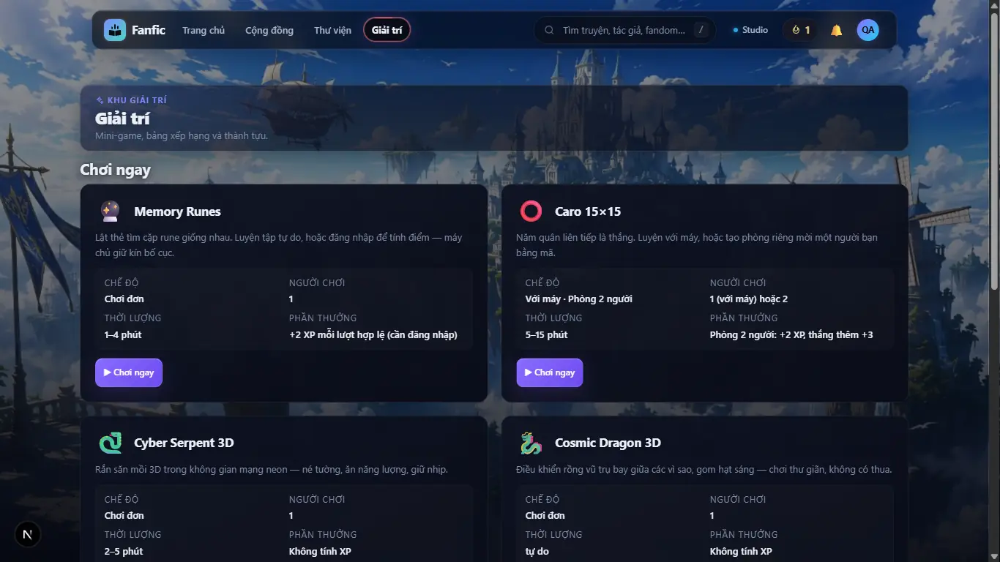 |
| Memory tính điểm xong (1440 / 390) | 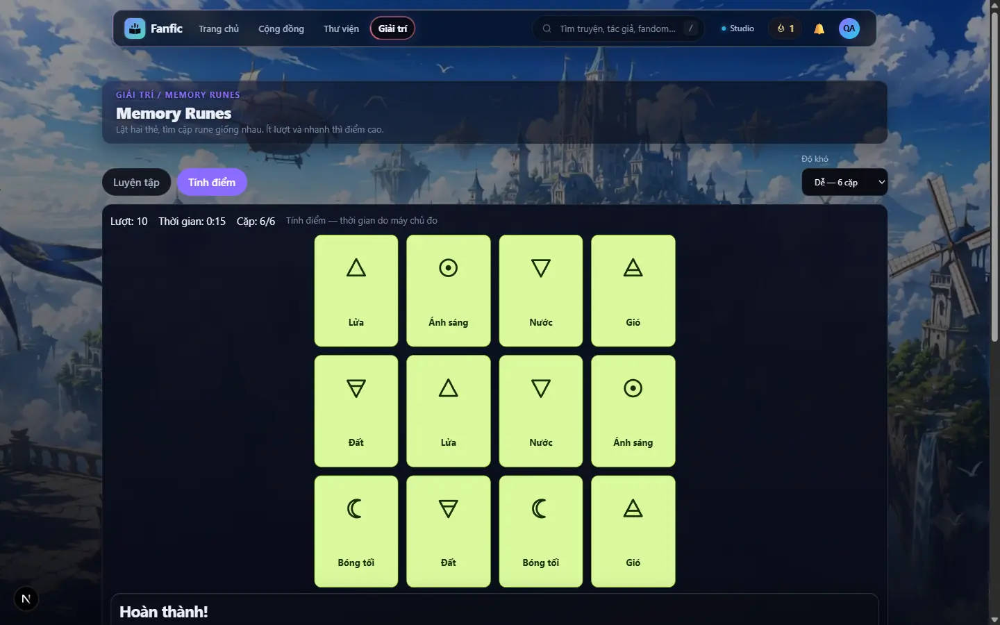 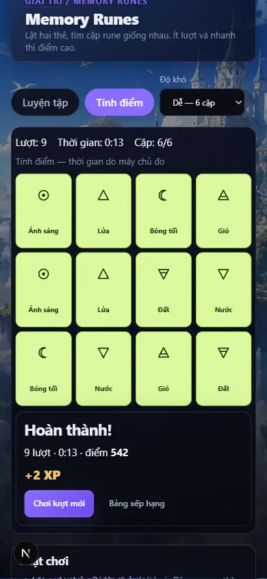 |
| Memory luyện tập xong (390) | 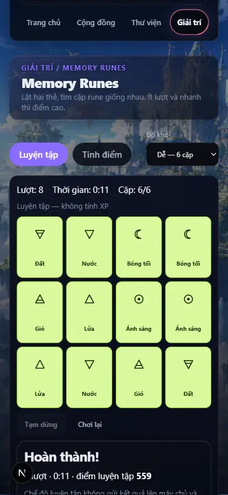 |
| Caro với máy (1440 / 390) | 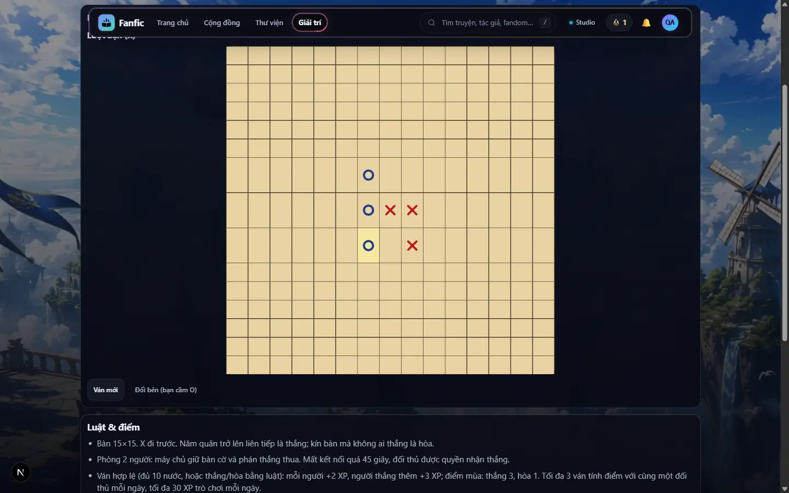 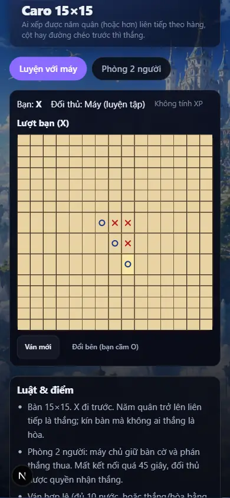 |
| Phòng 2 người trên điện thoại: sảnh / đang chơi / kết quả | 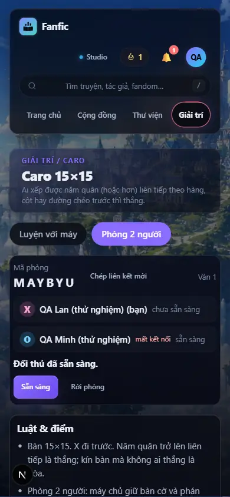 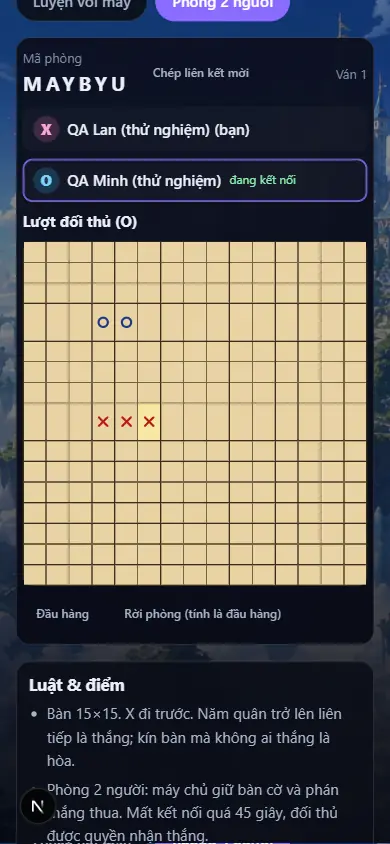 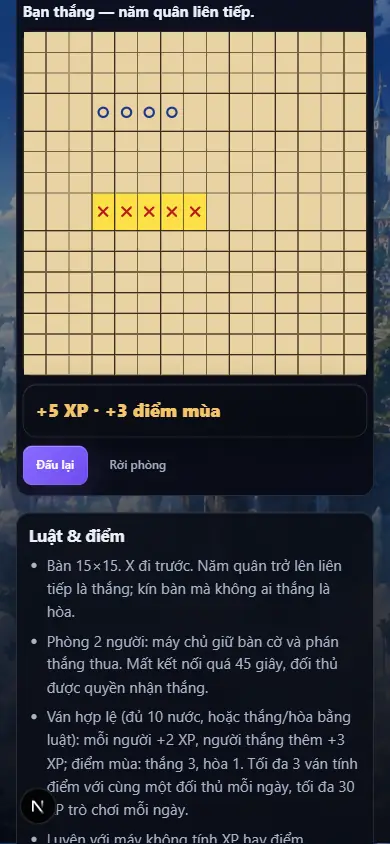 |
| Hai cửa sổ, hai tài khoản: người thắng / người thua | 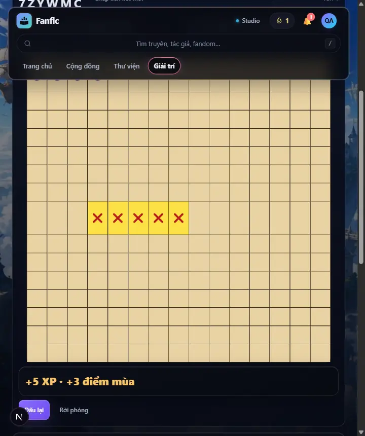 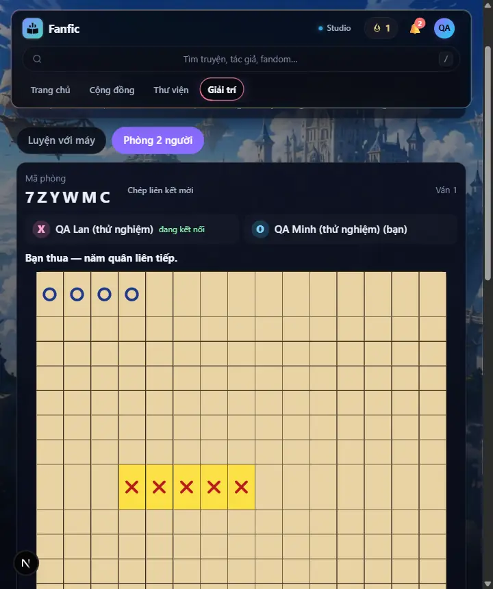 |
| Đối thủ mất kết nối → nút nhận thắng | 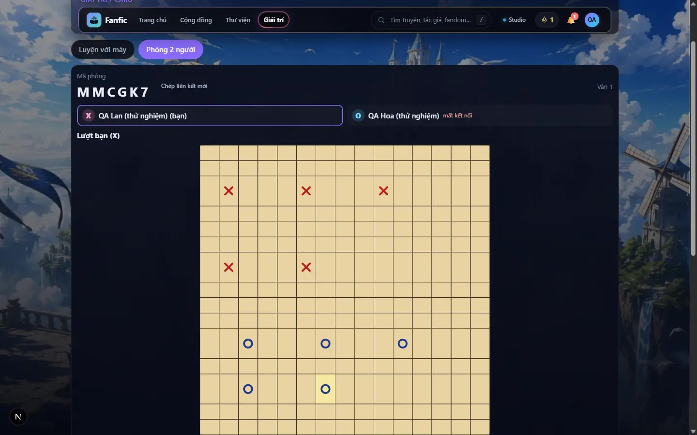 |
| Bảng xếp hạng Caro theo mùa | 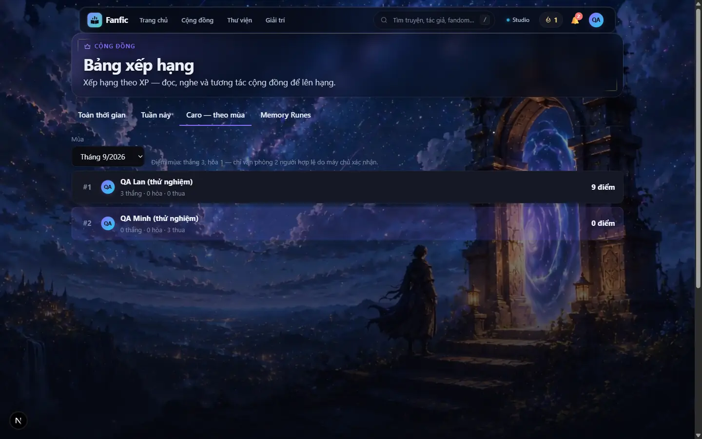 |

## 3. Kiểm thử

### 3.1 Backend — chạy trên Lightning CPU Studio (máy Windows thiếu RAM)

Máy Windows thiếu RAM (full suite ngốn RSS đỉnh ~4,3–4,8 GB), nên kiểm thử nặng chạy trên **Lightning CPU Studio có sẵn** `scratch-studio-devbox` (teamspace `default-project`). Đây không phải hệ CI mới: xác thực bằng `lightning_helper.resolve_lightning_credentials()` sẵn có, không đụng hàm TTS nào, không tạo Studio mới, không GPU. Studio được khởi động bằng `Machine.CPU` với `max_runtime` 1 giờ và **đã tắt lại** sau khi chạy (trước đó nó đang tắt).

| Hạng mục | Giá trị |
|---|---|
| Máy | CPU, 4 vCPU, 15,7 GB RAM; lúc bắt đầu không có workload nào khác ngoài dịch vụ nền tảng |
| Mã được kiểm | **snapshot candidate `c3844124bdecc490…d7bdd5`** (1723 tệp = tệp đã track trên đĩa + 21 tệp mới của gói C; loại media, `.env*`, khoá, `node_modules`, `.venv`, `server/var`, báo cáo viết sau). Baseline `84f1eb1b0ca33c09…8fd57b` = `git archive` của `351e8da` (PR B, backend giống `main`) |
| Khớp commit | commit `88e8b96`: **1723/1723 tệp khớp snapshot** (1689 chỉ khác CRLF do `core.autocrlf=true` trên Windows — Linux CI dùng LF), 0 lệch nội dung |
| Môi trường | venv RIÊNG trong thư mục test, Python 3.12.11 (khớp CI), `pip install -r server/requirements.txt` rồi `requirements-dev.txt` (requirements baseline = candidate); chạy bằng `env -i` (không kế thừa biến môi trường/secret của Studio), `FAS_ENV_FILE` = tệp rỗng, `DATA_BACKEND=mock`, `STORAGE_BACKEND=local`. Không chạm Appwrite/R2 |
| Lệnh | đúng lệnh CI: `python -m unittest discover -s server/tests -t . -v` (+ bước import runtime và `compileall` như CI); chạy **tuần tự**, một bước một lúc |

| Bước | Kết quả | Thời gian | RSS đỉnh |
|---|---|---|---|
| `import server.main, server.worker` (chỉ phụ thuộc runtime) | exit 0 | 1,6 s | 67 MB |
| Test mục tiêu (game ×7 bộ + gamification ×3 + rate limiting) | **139/139 OK** | 5,6 s | 75 MB |
| Full suite **baseline** | 4869 bài — 113 fail + 625 error = **734 hỏng** (khớp con số CI Linux của `main`) | 69,0 s | 4 846 MB |
| Full suite **candidate** | 4964 bài — 113 fail + 625 error = **734 hỏng** | 73,2 s | 4 258 MB |
| So tập hỏng theo **tên từng bài** | **0 bài hỏng mới, 0 bài tự hết hỏng**; 95 bài mới đều đạt | — | — |
| `compileall server` | exit 0 | 0,1 s | 13 MB |

Tập 734 bài hỏng sẵn có ở `main` chủ yếu là `KeyError: 'token'`: bộ đếm rate limit **toàn cục** tích luỹ qua cả suite nên `/api/auth/register` trả 429. Lần chạy đầu, bài route của gói C gọi `limiter.reset()`, vô tình xoá trạng thái đó giữa suite, làm 77 bài khác "tự xanh". Kết quả đó **không được tính**; đã bỏ reset (bài của gói C dùng tài khoản mới nên có khoá rate-limit riêng) và chạy lại — đó là kết quả trong bảng. Không skip/xfail bài nào, không vô hiệu rate limiter.

Chạy riêng trên Windows (nhẹ): 9 bộ game/gamification/route **122/122** trước ba sửa cuối; sau sửa: hợp đồng Appwrite **11/11** (bài hồi quy khoá CAS hỏng trên mã cũ, đạt trên mã mới), quyết toán **7/7**. `test_games_routes` sau khi bỏ `limiter.reset()` chỉ chạy trên Linux (nằm trong 139/139). **Full suite trên Windows không chạy** (thiếu RAM) — kết quả Linux không thay thế bằng chứng tương thích Windows cho toàn bộ suite.

Kiểm thử tích hợp **Appwrite thật: BLOCKED** — chưa có project thử nghiệm được phép; không dùng production.

### 3.2 Web (máy cục bộ)

| Lệnh | Kết quả |
|---|---|
| `cd web && npm test` | 1096 bài: **1090 pass, 0 fail**, 6 skip |
| `npm run typecheck` / `npx eslint` (tệp đổi) / `npm run build` | sạch / sạch / thành công |
| Tách gói | mã game chỉ nằm trong chunk của `/entertainment*`; không vào gói ban đầu của trang đọc/thư viện |

### 3.3 Đầu-cuối thật (Chrome hiển thị, backend mock cục bộ, tài khoản thử riêng, chuột/chạm thật)

| Kịch bản | Kết quả |
|---|---|
| **Hai người thật** — hai BrowserContext (hai cửa sổ, hai phiên đăng nhập) trong một Chrome: tạo phòng → vào bằng liên kết → sẵn sàng → đánh xen kẽ → thắng 5 liên tiếp → hai màn hình cùng thấy kết quả + XP → sổ cái → giả mạo/nước trùng/sai lượt/người ngoài/sau khi kết thúc → tải lại giữa ván → đấu lại (đổi bên) → rời giữa ván | **26/26 PASS** (trình tự nước lưu ở `c_logs/duel_replay.json`) |
| Mất kết nối: đối thủ im lặng > 45 s → nút hiện → bấm → thắng "timeout", ván đủ 10 nước nên hợp lệ | **6/6 PASS** |
| Memory tính điểm (1440 + 390): giải bằng lật thật; 40 phản hồi máy chủ, **0 phản hồi chứa bố cục**; XP +2 khớp sổ cái; lật trùng 409, quá nhanh 429, người khác 403 | **18/18 PASS** |
| Luyện tập (1440 + 390): Memory giải hết + không gọi API nào; Caro với máy trả lời mỗi nước | **18/18 PASS** |
| Phòng trên 390 / 360 / 1366 bằng chạm/bấm thật, không tràn ngang | **18/18 PASS** |
| Bảng xếp hạng Caro theo mùa với dữ liệu thật | 2 hàng đúng thứ tự, điểm = 3 × số thắng |

Sổ cái (dữ liệu thử): ván thắng 5 liên tiếp → người thắng `game_match_completed` + `game_match_won` (+5), người thua `game_match_completed` (+2); XP tài khoản tăng đúng +5/+2, XP có sẵn từ seed (80) không mất.

### 3.4 Review

Review chéo họ model qua `scripts/ai_router_dispatch.py --task-class SECURITY_REVIEW` → Antigravity **Claude Opus 4.6** (không Codex). Gói review là mã thật (domain, service, store, cộng XP nguyên tử, route), không lịch sử hội thoại, không bí mật. Không có mức critical/high.

| Phát hiện | Đánh giá | Xử lý |
|---|---|---|
| Trần 3 ván/cặp/ngày "chỉ đếm một chiều", đấu lại đổi ghế là né được | **Không đúng** — mỗi ván ghi hàng kết quả cho cả hai người | Khoá bằng test `PairCapDoiGheTest` (đổi người cầm X mỗi ván, ván 4–5 vẫn không tính) |
| Hai ván khác nhau của cùng cặp kết thúc cùng lúc có thể vượt trần 1 ván (tương tự trần lượt Memory) | Đúng, có trần | Ghi vào giới hạn đã biết (tài liệu migration §10) |
| Memory: bot nhớ hoàn hảo đạt điểm gần tối đa | Bản chất game trí nhớ; bố cục không lộ | Ghi rõ; XP bị trần |
| Tài khoản phụ đánh ≥ 10 nước rồi "mất kết nối" | Đúng, có trần 3 ván/cặp/ngày + 30 XP/ngày | Ghi rõ |
| Ghi hiện diện có thể đè `last_seen` vài mili giây | Không khai thác được | Ghi rõ |
| Trùng thưởng / mạo danh / thử lại vô hạn / mất thưởng khi sập | Reviewer xác nhận an toàn | — |

Trước đó, review của tôi trên mã builder viết đã tìm ra lỗi thứ tự quyết toán, lỗi rời phòng, lỗi trần cặp và lỗi khoá CAS (bảng mục 4).

## 4. Lỗi tìm và sửa trong gói này

| Hạng mục | Trước khi sửa | Sau khi sửa |
|---|---|---|
| Thứ tự quyết toán | Cộng XP rồi mới lưu kết quả; `xp_awarded` lấy từ giá trị trả về → sập giữa chừng: mất XP hoặc ghi 0 | Lưu quyết định trước, cộng từ hàng đã lưu, không bao giờ tính lại |
| Rời phòng giữa ván | Xoá ghế trước quyết toán → ván hợp lệ không ghi thắng/thua | Kết thúc (đầu hàng) giữ ghế → quyết toán → mới xoá ghế |
| Ván vượt trần cặp đối thủ | Vẫn tính vào số thắng/tie-break | Không tính (validated = false) |
| Đếm trần cặp khi thử lại | Tự đếm cả ván đang quyết toán | Loại chính ván đó |
| Appwrite `award_xp_atomic` | Commit bị từ chối mà không ném lỗi → thử lại mãi | Cả hai nhánh đi qua cùng phép kiểm "đã cộng chưa" |
| Mất lần cộng khi hai lần ghi nối tiếp | Giao dịch chỉ bắt xung đột đồng thời | Hàng khoá CAS `xp_progress_cas` trong cùng giao dịch |
| Khoá CAS gắn với con số XP | XP bị chỉnh về giá trị cũ → khoá cũ còn → không bao giờ cộng được nữa | Khoá gắn với trạng thái hàng (`$updatedAt`); bài hồi quy tái hiện được lỗi trên mã cũ |
| Độ phân giải thời gian lật | Mốc theo giây → 429 sai | Micro giây |
| Bài route gọi `limiter.reset()` | Xoá bộ đếm toàn cục giữa suite → 77 bài khác "tự xanh", làm nhiễu phép so baseline/candidate | Bỏ reset; chạy lại: tập hỏng trùng khớp baseline |
| Mã phòng/lượt không tồn tại | Lọt thành 500 | 404 |
| Nút nhận thắng | Chỉ hiện khi tới lượt đối thủ, dù API cho nhận bất kể lượt | Hiện khi đối thủ mất kết nối, bất kể lượt |
| Giao diện | Lưới thẻ cao hơn màn hình; bàn Caro vượt màn hình; hub để một thẻ lẻ | Co theo chiều cao khung nhìn; lưới 2×2 |

## 5. Chưa làm / bị chặn (nói thẳng)

- **MULTIPLAYER_PRODUCTION_BLOCKED**: cần (1) duyệt và chạy migration 6 collection (`docs/migrations/SOCIAL_PLAY_V1_GAMES_SCHEMA.md`), (2) chuyển `award_xp`/`claim_quest_reward` cũ sang `award_xp_atomic` (đường cũ đọc-sửa-ghi vẫn có thể mất một lần cộng khi chạy song song với quyết toán game trên Appwrite), (3) kiểm đường Appwrite trên một **project thử nghiệm** — chưa có project thử nghiệm được phép nên **BLOCKED** (không dùng production).
- Đường Appwrite (`AppwriteGamesStore`, giao dịch 3 thao tác) chỉ có test hợp đồng với client giả lập — **UNVERIFIED** trên Appwrite thật.
- Điều chỉnh bù có kiểm toán cho quản trị: chưa làm (chỉ có xem đối soát).
- Vận chuyển là thăm dò HTTP (1 s khi đang chơi, 2,5 s ở sảnh) — không WebSocket/Durable Object; đủ cho lưu lượng thấp, không cần hạ tầng mới. Bảng xếp hạng theo mùa tổng hợp từ `game_results` của mùa đó mỗi lần gọi — cần bảng tổng hợp nếu lưu lượng lớn.
- Ô Caro trên màn hình 360–390 px chỉ ~21–24 px (15 cột trên bề ngang điện thoại).
- Không chống bot tuyệt đối: có trần XP, giới hạn nhịp lật, kiểm độ hợp lý thời gian — ghi đúng như vậy.

## 6. Danh sách chấp nhận cho chủ dự án

- [ ] Hai tài khoản khác nhau chơi hết một ván Caro qua liên kết mời; cả hai thấy cùng kết quả và XP.
- [ ] Memory Runes: luyện tập không cần đăng nhập; tính điểm hiện XP ở màn kết quả.
- [ ] Bảng xếp hạng có tab Caro/Memory tách khỏi XP tài khoản.
- [ ] Duyệt (hoặc không) migration + việc chuyển đường XP cũ trước khi bật `FAS_GAMES_V1` trên production.
